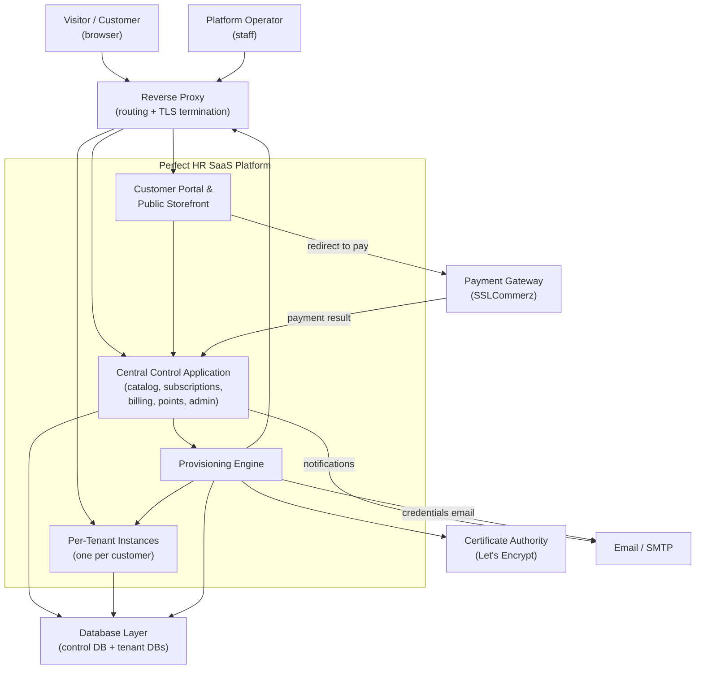
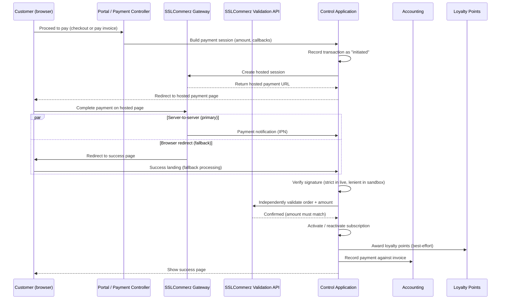
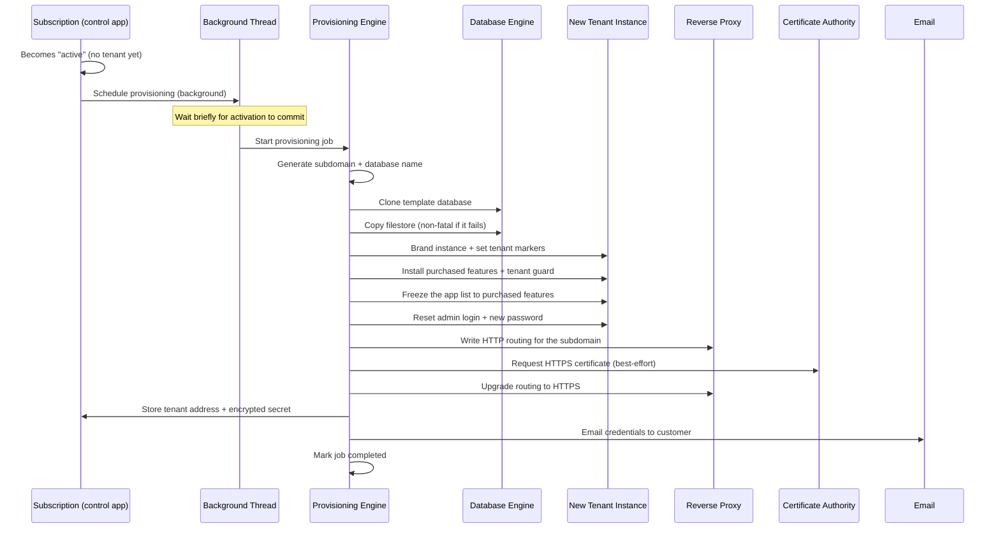
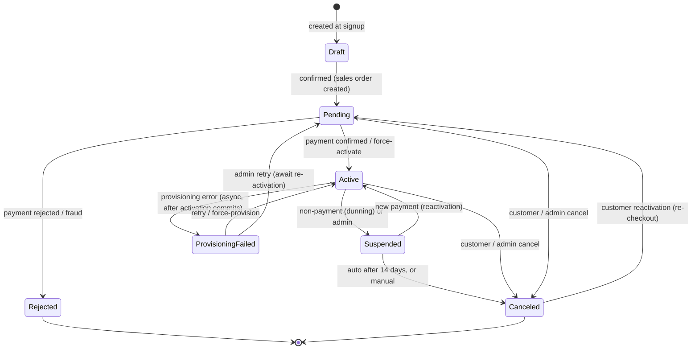
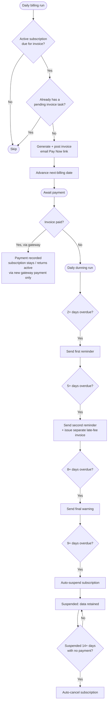

# Perfect HR SaaS Suite — Functional Architecture Document

## Executive Summary

The Perfect HR SaaS Suite is a self-service, multi-tenant SaaS platform built on Odoo 18 Community Edition. It lets a prospective customer discover subscription plans on a public website, choose a plan and commitment length, create an account, pay online through the SSLCommerz payment gateway, and — automatically and without manual intervention — receive their own fully isolated Odoo instance running on a dedicated subdomain with HTTPS. Once a customer is live, the platform handles the ongoing business relationship end to end: it generates recurring invoices, chases unpaid bills through an escalating dunning process, applies late fees, suspends non-payers, and rewards paying customers with a loyalty-points program that can be redeemed for discounts.

The product's core value is that it turns "selling business software" into a hands-off, subscription-driven operation. A single central control application markets the plans, takes the money, provisions the customer's private instance, and keeps every instance locked down to exactly the features that customer paid for — while giving the platform operator a command-center dashboard, override controls, and automated health monitoring to run the whole business. This document explains how the whole product works conceptually, for product managers, operations staff, and new engineers.

> **A note on terminology used throughout.** Several concepts recur so often they are worth defining once, up front:
> - **Best-effort / non-fatal** — the step is attempted, but if it fails the larger operation is *not* aborted; the failure is logged and the flow continues. (Examples below include auto-login after signup, copying the tenant filestore, issuing the HTTPS certificate, sending the credentials email, and awarding loyalty points.)
> - **Features (= application modules)** — when this document says a plan "includes features," those features are Odoo application modules. The two terms are used interchangeably for a non-technical audience.

---

## 1. The Product at a Glance

### The SaaS Proposition

The platform sells access to hosted business software as a subscription. Instead of installing anything, a customer picks a plan, pays, and is handed the keys to their own private, ready-to-use Odoo instance at their own web address. Everything after that — billing, renewals, reminders, loyalty rewards, and instance management — is automated.

### Who It Serves

| Audience | What they get |
| --- | --- |
| Prospective customers | A public storefront to compare plans, calculate prices for different commitment lengths, and sign up in one flow |
| Paying customers (tenant admins) | A private, isolated software instance on their own subdomain, plus a self-service portal to manage subscriptions, invoices, points, and access |
| Platform operator (SaaS provider staff) | A back-office command center to monitor the business, intervene on stuck subscriptions, and watch system health |

### Headline Capabilities

- A public plans-and-pricing page with an interactive "Customize Your Plan" price calculator.
- Self-service signup, checkout, and online payment via a Bangladeshi payment aggregator (cards plus mobile wallets like bKash, Nagad, Rocket).
- Fully automated provisioning of an isolated instance per customer, on a dedicated HTTPS subdomain.
- Per-tenant feature lockdown so customers only ever see and use what their plan includes.
- Automated recurring billing, escalating dunning, late fees, and automatic suspension of non-payers.
- A loyalty-points program: earn on payment, redeem for discounts, with automatic expiry.
- An operator dashboard with KPIs, drill-through, manual override controls, and hourly system-health monitoring.

---

## 2. Actors & Personas

| Persona | Who they are | What they do |
| --- | --- | --- |
| **Visitor (prospective customer)** | Anonymous website browser | Browses the public pricing page, uses the price calculator, and decides whether to sign up. No login required to look. |
| **Customer / Tenant Admin** | A paying subscriber who owns an instance | Signs up, pays, accesses their private instance, manages their subscription/invoices/points in the portal, and is the administrator inside their own instance (but with restricted app-management rights). |
| **Platform Administrator** | The SaaS provider's own operations staff | Defines and prices plans, monitors the business dashboard, intervenes on stuck subscriptions with force-actions, deletes tenants when needed, configures the gateway and billing rules, and watches system health. |
| **The Automated System** | Scheduled jobs and event-driven background processes | Provisions instances, generates invoices, runs dunning, applies late fees, suspends non-payers, auto-cancels long-suspended subscriptions, expires loyalty points, retries failed provisioning, and runs hourly health checks. |

The Platform Administrator's access is governed by a high-privilege "SaaS Manager" role (which also carries full system-administrator rights) and a read-only "SaaS Viewer" role for staff who only need health visibility. Internal users generally have read-only visibility into operational data.

---

## 3. High-Level Architecture

### System-Context Diagram

### The Major Pieces

**Customer Portal & Public Storefront.** The public-facing front door. On the public side it presents the plans-and-pricing landing page, a reusable pricing block that can be embedded on other pages (including the homepage), an interactive price calculator, and the signup/checkout flow. On the logged-in side it extends the standard customer portal so subscribers can view and manage their subscriptions, download invoices, pay outstanding bills, redeem loyalty points, and jump into their live instance. It is the glue that turns the underlying engines into an end-to-end buyer and self-service experience.

**Central Control Application.** The brain of the platform. It holds the product catalog (the sellable plans), every customer subscription and its lifecycle status, the billing and dunning machinery, the loyalty ledger, the payment transaction log, and the operator dashboard. This is where money is taken, decisions are made, and secrets are stored — and it is the single database that knows about *all* customers.

**Provisioning Engine.** The automation that builds a new customer instance. When a subscription becomes active, it clones a template instance into a fresh isolated database, installs only the purchased features plus a lockdown guard, brands the instance, resets its admin login, sets up web routing and an HTTPS certificate, and emails the customer their credentials. It runs in the background so activation feels instant.

**Per-Tenant Instances.** Each customer's private copy of the software, living in its own isolated database and reachable at its own subdomain. A tenant instance contains only that customer's business data and only the features they paid for.

**Database Layer.** The database engine hosts two kinds of databases: one central control database (subscriptions, payments, encrypted secrets, points, catalog) and many tenant databases (one per customer, holding only that customer's own data). They are kept strictly separate.

**Reverse Proxy.** Sits in front of everything and routes each incoming web request to the correct destination by looking at the hostname. A request to a customer's subdomain is routed to that customer's database; a request to the platform's own domain reaches the storefront and control application. The proxy also terminates HTTPS.

**Payment Gateway.** SSLCommerz, a Bangladeshi payment aggregator, hosts the actual payment page and confirms outcomes back to the platform. It is the sole payment method.

**Certificate Authority.** Let's Encrypt issues the HTTPS certificate for each customer's subdomain automatically during provisioning.

### How Traffic Flows

1. A visitor's browser reaches the reverse proxy, which routes to the storefront. The visitor browses plans and signs up.
2. At checkout, the browser is redirected out to the SSLCommerz hosted payment page. The customer pays there.
3. SSLCommerz confirms the result back to the control application through two channels (a server-to-server notification and a browser redirect).
4. On a confirmed payment, the control application activates the subscription, which triggers the provisioning engine in the background.
5. The provisioning engine creates the tenant database, sets up proxy routing and a certificate, and emails credentials.
6. The customer then reaches their own instance by visiting their subdomain; the proxy routes the request to their dedicated database.

> **Deployment prerequisite.** The provisioning engine performs privileged operations directly on its Linux host — creating and cloning databases, running the Odoo command line to install features, editing and reloading the reverse-proxy configuration, and requesting certificates — several of which require pre-granted elevated (sudo) permissions. Provisioning therefore only works on a properly configured Linux server; it is not functional in a plain desktop or development environment. This is an important constraint for operations staff and for engineers setting up a new server.

---

## 4. The Multi-Tenancy Model

Multi-tenancy is the heart of the platform: every paying customer gets a completely separate instance, and the platform keeps them apart at several layers.

### One Database Per Tenant

Each customer's instance lives in its own dedicated database, created by cloning a pristine "template" database. Because it is a full clone, the customer starts with a working, self-contained instance rather than a shared, partitioned one. A customer's business data never lives in the same database as any other customer's data.

### Subdomain-to-Tenant Mapping

The key trick is that **a tenant's database is named exactly after its subdomain** (for example, a database named `abc123def456.dev.perfecthr.net`). The reverse proxy and the application router are configured so that an incoming request for a hostname is served *only* by the database with that exact same name. This gives a strict one-to-one binding: one subdomain hostname maps to exactly one tenant database, and there is no way for a request to one subdomain to reach another tenant's data.

### Keeping Tenants Separated and Locked Down

Isolation is enforced in layers:

- **Data isolation** — separate databases mean no shared tables and no cross-tenant queries.
- **Routing isolation** — the hostname-equals-database rule hard-binds each subdomain to one database.
- **Feature lockdown** — every tenant instance has an always-installed "tenant guard" that freezes the set of usable features to exactly the purchased plan. Even the customer's own admin cannot re-scan for new apps, install features outside their plan, or uninstall anything.
- **Secret protection** — the connection password for each tenant database is stored only in encrypted form, and only in the central control database.

### Central Control Database vs. Tenant Databases

| | Central Control Database | Tenant Databases (many) |
| --- | --- | --- |
| How many | Exactly one | One per customer |
| Contains | The plan catalog, all subscriptions, payment transaction logs, the loyalty ledger, encrypted tenant secrets, and the operator dashboard | Only that customer's own business data |
| Knows about | All customers | Only itself — never references other tenants |
| Who uses it | Platform operator, storefront, billing, provisioning | The customer and their own users |
| Feature lockdown | None — operators keep full control | Enforced by the tenant guard |

Deleting one tenant database has no effect on the control database or on any other tenant.

---

## 5. The Eight Building Blocks

The suite is composed of eight modules. Seven run in the central control application; one (the tenant guard) is installed inside every customer instance.

For engineers navigating the code, each friendly name below maps to a technical module name:

| Friendly name | Technical module | Functional role |
| --- | --- | --- |
| **Packages (catalog)** | `saas_package` | Defines the sellable plans — pricing, included features, discount tiers — and establishes the shared menu and permission roles for the whole suite |
| **Subscription Manager** | `saas_subscription` | The operational heart: manages each subscription's lifecycle and triggers automated provisioning of a new tenant on activation |
| **Billing** | `saas_billing` | Automates recurring invoices, escalating dunning, late fees, and auto-suspension of non-payers |
| **Loyalty Points** | `saas_points` | The rewards engine: earns points on payment, redeems them for discounts, and expires them over time |
| **SSLCommerz Payment** | `saas_payment_sslcommerz` | Connects the platform to the SSLCommerz gateway; handles the full payment journey and verification |
| **Customer Portal** | `saas_portal` | The public storefront and logged-in self-service portal |
| **Admin Dashboard** | `saas_admin` | The operator command center: KPIs, override controls, tenant deletion, and system-health monitoring |
| **Tenant Guard** | `saas_tenant_guard` | A lightweight lockdown installed inside every tenant to freeze it to the purchased feature set |

### 5.1 Packages (the catalog)

**Purpose.** This is the product catalog. An administrator defines the sellable plans — each with a name, description, image, pricing, a set of included application features (Odoo application modules), marketing feature bullets, and duration-based discount tiers. It is the foundational module: it creates the top-level "SaaS" menu and the manager/user permission roles that the other seven modules build on.

**Capabilities.** Each plan can carry three prices (a monthly price, a yearly price, and an optional one-time setup fee). Administrators attach the set of application features a plan delivers, build a marketing bullet list (each bullet either auto-labeled from an included feature or free text with an optional icon), and define duration-discount tiers (for example, monthly at 0%, quarterly at 5%, annual at 15%). Plans can be marked "Popular," archived without deletion, and duplicated as a starting point for a new plan. The module computes a full pricing breakdown for any chosen commitment length — base price, discount percent, amount saved, effective monthly price, total for the term, setup fee, and included features — that the pricing page and checkout reuse so the price shown is consistent everywhere. It also exposes the duration tiers as ready-to-render data so the reusable pricing block can build its duration selector on any page.

**How it connects.** The portal reads active plans to render the pricing cards and calculator. The subscription manager links each subscription to a plan and uses the plan's pricing math and feature list. Billing and payment reach the plan (via the subscription) to determine amounts. It defines the "SaaS Manager" and read-only "SaaS User" roles the whole suite relies on.

> Note: the module also retains an older "legacy" coupon-style discount mechanism for backward compatibility, but the actively used pricing path is the duration-tier system.

### 5.2 Subscription Manager

**Purpose.** The operational heart of the platform. It manages the full lifecycle of a customer's subscription — from draft, through payment, activation, suspension, and cancellation. When a subscription becomes active, it automatically provisions a brand-new isolated instance for the customer. Every state change is audit-logged.

**Capabilities.** Each subscription links a customer to a chosen plan, carries a human-readable reference number, and moves through a strictly guarded lifecycle. Confirming a subscription automatically creates a confirmed sales order priced for the committed duration. On activation it launches provisioning in the background so the activation itself completes instantly. It supports monthly or yearly billing and commitment durations, and provides manual admin controls (confirm, activate, suspend, cancel, reject, retry failed provisioning, force-provision without payment, manual renewal, and change-plan). It keeps a complete state-change history and surfaces related invoices, the sales order, and loyalty figures on each subscription.

**How it connects.** It depends on the catalog for plan definitions and pricing, works hand-in-hand with the payment module (which activates the subscription on successful payment), installs and relies on the tenant guard inside every provisioned instance, feeds the billing module, surfaces to customers through the portal, and provides the data and actions the admin dashboard extends.

> Notes: canceling a subscription does not itself tear down the tenant database (that is a manual/admin operation). Reactivating a suspended subscription does not recreate its tenant, since the tenant already exists.

### 5.3 Billing

**Purpose.** Automates the money side. It turns active subscriptions into recurring invoices and chases unpaid ones. On a daily schedule it generates renewal invoices, emails a "Pay Now" link, then runs a staged dunning process that sends escalating reminders, applies a late fee, and ultimately suspends the customer if the invoice stays unpaid.

**Capabilities.** Daily recurring invoicing for due active subscriptions (using the monthly or yearly plan price by billing cycle), automatic invoice posting, and advancing the next-billing date. An "invoice queue" records every invoicing attempt as an audit log. A staged dunning process escalates through a first reminder, a second reminder with a late fee, a final 24-hour warning, and then suspension. The late fee (defaulting to 5% of the overdue amount) is issued as a *separate* new invoice so the original document is never altered. A self-healing safety net catches subscriptions that should have been invoiced but were missed. Staff can also raise a one-off manual invoice with a mandatory reason.

**How it connects.** It reads subscriptions and their billing details, reads plan pricing via the subscription, uses the subscription link that the loyalty module adds to invoices, routes payment links through the SSLCommerz flow, and directs customers to the portal.

> Notes: the dunning day-thresholds are effectively fixed (reminders at 2, 5, 8 days and suspension at 9 days) even though a settings screen for reminder days and grace period exists; only the late-fee percentage setting is actually consulted at runtime. This module raises the suspension but does not itself delete or reactivate data. A "cleanup resolved dunning records" schedule also exists, but because the code never actually marks a dunning record "resolved," that cleanup job never has anything to act on and is effectively inert.

### 5.4 Loyalty Points

**Purpose.** The incentive/retention layer. Customers automatically earn points when they pay, accumulate a balance, and can redeem points for a discount on future payments. Points expire after a configurable period. A full, auditable ledger records every point earned, redeemed, or expired. It is not required for provisioning or billing to work.

**Capabilities.** Points are awarded automatically when a subscription payment succeeds or when a customer invoice becomes paid, calculated as the paid amount times a configurable earn rate (the invoice path uses the pre-tax subtotal, so tax and late fees do not earn points). A per-customer balance record tracks current balance and lifetime totals. Redemption is validated against a minimum threshold, sufficient balance, and a maximum-discount cap. Points can be redeemed from a "My Points" portal page, or by staff via a back-office wizard, and the checkout page offers a redemption option as well. A daily job expires points past their expiry window. Aggregate loyalty metrics feed the admin dashboard.

**How it connects.** Points are always tied to a subscription and its customer. The payment module is the primary earning trigger; accounting invoices are the secondary trigger. The portal reads balances and history and offers redemption at checkout. The catalog supplies the shared permission role.

> **Two verified caveats worth flagging for stakeholders:**
> - **Possible double-earning gap.** The two earning triggers use *different* duplicate-protection keys: the payment path suppresses a repeat only within a short (5-minute) window for the same subscription, while the invoice-paid path suppresses at most one earn per invoice. Because the keys differ, if *both* triggers fire for the same payment (a successful gateway payment *and* the resulting invoice being marked paid), the customer can be awarded points twice. This is a real gap, not a safeguard.
> - **Checkout redemption not deducted at gateway pay time.** As currently coded, the checkout page lets a customer *preview* a points discount, but the payment form does not send the flag the pay handler checks for, so the previewed points are **not** actually deducted when the customer pays through the gateway (the gateway is charged the full amount and no redemption ledger entry is written). Redemption only truly runs through the "My Points" portal route or the internal admin wizard. Point-award failures, by contrast, are non-fatal — they never block a payment.

### 5.5 SSLCommerz Payment

**Purpose.** Connects the platform to SSLCommerz so customers can pay online using local and international methods (VISA, MasterCard, AMEX, plus mobile wallets bKash, Nagad, Rocket). It handles the whole payment journey: sending the customer to the hosted payment page, receiving the outcome, independently verifying the payment is genuine and for the correct amount, and then acting on it — activating the subscription, recording the payment in accounting, and awarding loyalty points.

**Capabilities.** It redirects a customer to the hosted payment page for a new subscription, a renewal, or a specific outstanding invoice, computing the amount automatically (plan price by cycle plus a first-time setup fee, or the invoice total for invoice payments). It receives outcomes through a reliable server-to-server confirmation channel and a browser-redirect fallback, independently re-verifies every apparently-successful payment against the gateway's validation service (rejecting amount mismatches), and validates a signature on incoming notifications. On confirmation it activates or reactivates the subscription, awards points, and records the payment against the invoice. It keeps a detailed transaction log and provides an admin screen to enter gateway credentials and toggle test/live mode.

**How it connects.** It extends the subscription module and calls its activation action, works with billing and accounting to settle invoices, reads plan pricing, and awards points through the loyalty module.

> Notes: security is intentionally split by mode — sandbox/test mode is lenient (to cope with the flaky sandbox validator), while live mode strictly enforces signature and amount validation. Leaving the platform in sandbox mode against real traffic would weaken fraud protection. The server-to-server notification endpoint is unauthenticated by design (the gateway cannot log in), and when a notification arrives it self-selects which database to act on — trying the configured database, then the request's database, then matching the incoming hostname, and finally falling back to the first available database as a last resort. When it records a payment in accounting it always uses the first bank journal it finds. These are operationally and security-relevant behaviors covered further in Section 8.

### 5.6 Customer Portal

**Purpose.** The public storefront and the logged-in self-service portal.

**Capabilities.** Publicly: a plans-and-pricing landing page of pricing cards, a reusable embeddable pricing block, an interactive "Customize Your Plan" calculator with a live price breakdown, and a self-service signup + checkout flow that creates the account and subscription and hands off to the payment gateway. It presents a loyalty-points redemption option at checkout (and skips the gateway entirely if points cover the whole order), and shows a live provisioning-status page that polls until the instance is ready. For logged-in subscribers: a "My Subscriptions" list, subscription detail with invoice history and tenant-access links, self-service cancellation and reactivation, a "My Invoices" page with PDF download, and a "My Points" page.

**How it connects.** It reads plans and pricing from the catalog, creates and manages subscriptions, triggers the payment session, reads and redeems loyalty points, and surfaces billing's invoices — while performing ownership checks so a customer only sees their own data.

> Notes: only monthly billing is currently selectable in the pricing UI (the yearly toggle is hidden); the public provisioning-status and completion pages are intentionally accessible without login because the session can be lost during the payment-gateway redirect. As noted under Loyalty Points, the checkout redemption option currently previews a discount but does not deduct the points at gateway pay time.

### 5.7 Admin Dashboard

**Purpose.** The back-office command center for the platform operator — not for customers. It gives a single visual dashboard of business health and a set of override ("force") controls to intervene on individual subscriptions when automation gets stuck. It also runs an hourly system-health check.

**Capabilities.** A "SaaS Command Center" dashboard with headline KPIs (active subscriptions, pending payment, monthly revenue, active loyalty balance), a 30-day revenue trend, subscription breakdown by status, loyalty and provisioning summaries, a recent-activity feed, package-popularity ranking, and live server-resource bars. Every tile drills through to the underlying filtered list. Per-subscription override buttons (Force Activate, Force Suspend, Force Cancel, Retry Provisioning, Delete Tenant), a bulk force-action wizard, and a guarded permanent tenant-deletion wizard (requiring an explicit confirmation and a written reason). A system-health log records each hourly snapshot and emails staff on a critical condition.

**How it connects.** It reads from subscriptions, catalog, billing, points, and accounting to build the dashboard; it originates little data of its own and acts as an operational overlay across the whole suite.

> **Notes and verified caveats:**
> - Health thresholds are fixed in code (for example, disk over 85% is a warning, over 95% is critical). Server metrics degrade gracefully to zero if the host metrics library is unavailable.
> - **"Force Provision" vs. "Retry Provisioning" behave differently.** The dashboard's "force-provision" helper merely flips a subscription's status straight to active — it does **not** kick off a real provisioning run — whereas "Retry Provisioning" correctly resets the subscription to pending so it is re-queued for a genuine provisioning attempt on next activation. Operators should expect force-provision to change status only.
> - **Cancelled count reads as zero.** The dashboard's subscription breakdown counts states named "cancelled"/"force_cancelled," but the subscription model's actual state value is spelled "canceled" — so the Cancelled tile effectively always shows zero and its drill-through returns nothing.
> - **Recent-activity feed silently falls back.** The activity feed tries to read audit-log fields that do not exist on the log record, so that read fails and the dashboard silently falls back to simply listing recently-created subscriptions as the "activity."
> - **Refund and failed-invoice retry helpers are programmatic-only.** Manual refund and failed-invoice retry helpers exist in the shared logic layer but are not wired to any dashboard button or menu, so they are reachable only programmatically today; and the failed-invoice retry helper only posts a reminder note — it does not regenerate or resend an actual invoice. Stakeholders should not assume a one-click refund exists in the UI.

### 5.8 Tenant Guard

**Purpose.** A lightweight, invisible security lockdown automatically installed inside every tenant instance during provisioning. Its job is to freeze the tenant's usable features to exactly the purchased plan and stop the tenant's own admins from expanding, discovering, or dismantling the software beyond that entitlement.

**Capabilities.** It blocks re-scanning the server for available apps, blocks installing any feature not on the plan's allowed list (showing a friendly upgrade message instead), and blocks uninstalling anything at all. It only enforces these rules on genuine tenant databases — the central control database behaves normally so operators keep full control.

**How it connects.** It is installed and configured by the provisioning process, which stamps a tenant marker and an allowed-features list into each tenant database. It works alongside the provisioner's other lockdown steps to make plan-based feature gating actually enforceable, protecting the upgrade/upsell path.

> Note: the install restriction "fails open" if the allowed-features list is missing, whereas the re-scan and uninstall blocks depend only on the tenant marker — so the tenant marker is the more critical value for lockdown integrity.

---

## 6. Core Lifecycles & Workflows

### 6.a Customer Journey & Onboarding

A visitor opens the public pricing page — no login required — and sees a card per active plan plus a "Customize Your Plan" calculator. Choosing a plan and duration shows a live price breakdown pulled from the same pricing math used everywhere else, so the number is consistent. Clicking "Get Started" carries the chosen plan and duration into a signup gate. If the visitor is already logged in, signup is skipped entirely. Otherwise they fill in a signup form (name, email, password with confirmation), which is validated (required fields, matching passwords, minimum length, and rejecting an email that already has an account). A new portal account is created and the visitor is auto-logged-in on a best-effort basis.

At that point the platform creates the subscription record in draft, immediately confirms it (which builds a confirmed sales order priced for the committed duration and moves it to "Pending Payment"), and sends the customer to the checkout page. Checkout shows a duration-aware order summary — base price, discount, subtotal, setup fee, any previewed points discount, and final total — and a pay button. Submitting it kicks off an SSLCommerz payment session and redirects the browser to the hosted payment page. From here, payment confirmation and provisioning happen downstream. If redeemed points fully cover the order, the gateway is skipped and the subscription is activated immediately.

### 6.b Payment Processing

The critical principle is that a payment is only treated as truly successful after it passes an independent re-validation with the gateway and the validated amount matches the expected amount — never merely because the customer landed on the success page. Two redundant channels (a server-to-server notification and the browser redirect) ensure a payment is not missed, and the processing is idempotent so both channels firing does not double-activate, double-charge, or double-award points. On a confirmed payment the subscription is activated (or reactivated from suspended), points are awarded (best-effort, non-fatal), and a payment is recorded against the relevant invoice.

### 6.c Automated Tenant Provisioning

When a subscription first becomes active with no tenant yet, provisioning is scheduled onto a background thread so the activation commits immediately and the customer sees "active" right away. The engine generates a unique subdomain (and an identically-named database), clones the template database and its filestore, brands the new instance and stamps it with tenant markers, installs only the purchased features plus the always-on tenant guard, physically freezes the app list to those features, resets the admin login with a fresh password, writes the proxy routing (HTTP first, then upgraded to HTTPS via a certificate), stores the tenant's address and *encrypted* database password on the subscription, and emails the customer their URL, username, and password. The HTTPS step and the credentials email are best-effort: their failure does not tear down an otherwise-working tenant.

If any critical step fails, the subscription is marked "provisioning failed" and the half-built tenant is rolled back — but the rollback is **best-effort and partial**: it drops the tenant database and removes the proxy routing, yet it does **not** delete the copied filestore directory or any HTTPS certificate that was already issued. Those orphaned artifacts can accumulate on the host across repeated failures and may need occasional manual cleanup by operations staff.

> Note: a scheduled retry job for failed provisioning exists but is misconfigured, so in practice recovery from a failed provision is done manually by an admin (retry or force-provision).

### 6.d Subscription Lifecycle & States

There are exactly seven states: **Draft**, **Pending Payment**, **Active**, **Suspended**, **Canceled**, **Rejected**, and **Provisioning Failed**. State changes are the single source of truth: every change is audit-logged, attempts to email the customer, and — when a subscription first becomes active — kicks off provisioning. Transitions are strictly guarded (for example, only a draft can be confirmed; only an active subscription can be suspended; only a pending one can be rejected). Provisioning is triggered only when activation comes from pending or provisioning-failed and no tenant exists yet, so reactivating a suspended subscription never recreates its instance.

Note that the **Active → Provisioning Failed** edge happens *after the fact*: activation commits first (the customer immediately sees "active"), then the background provisioning engine runs, and only if it fails does it asynchronously flip the subscription to "provisioning failed." The activation itself is never rolled back by a provisioning failure.

> Important: there is no "expired" state. What might be thought of as expiry is implemented as automatic **cancellation** — a daily job cancels any subscription that has sat suspended for more than 14 days. Also note that suspension does not currently block login to the tenant instance, and cancellation does not automatically tear down the tenant database; teardown is a manual admin operation.

### 6.e Recurring Billing, Dunning & Late Fees

A daily job generates and posts a renewal invoice for each active subscription that has reached its next-billing date, emails a "Pay Now" link, and advances the billing date. A separate daily dunning job scans overdue, unpaid, posted invoices for active subscriptions and escalates strictly by days overdue: a first reminder at 2+ days, a second reminder plus a late fee (default 5%) at 5+ days, a final warning at 8+ days, and automatic suspension at 9+ days. The late fee is always issued as a brand-new separate invoice so the original is never altered. Because that late-fee invoice is itself given a due date of just one day out, it can quickly become overdue and spawn its own dunning chain — its own reminders and even its own late fee. A subscription that stays suspended for more than 14 days is auto-canceled by a housekeeping job.

Crucially, **reactivation is not driven by the billing jobs** — the "Reactivate" path back to active is reachable *only via a fresh gateway payment*. A suspended subscription returns to active when a new SSLCommerz payment succeeds; merely reconciling the invoice by other means would not lift the suspension.

### 6.f Loyalty Points

Points are earned automatically when a subscription payment succeeds (the primary trigger) or when a customer invoice becomes paid (the secondary trigger), calculated as the paid amount times a configurable earn rate. Each customer has a running balance that is always recomputed as the sum of their entire ledger, so earn, redeem, and expire entries stay consistent. A customer can redeem points for a discount from the "My Points" portal page or via a back-office wizard, and the checkout page also offers a redemption option; redemption is subject to a minimum threshold, sufficient balance, and a cap on how much of an order points may cover. Redemption records a negative ledger entry. A daily job expires points past their expiry window by recording an offsetting negative entry, and marks the original as processed so it is never expired twice. Point-award failures are deliberately non-fatal, so they never block a payment or activation. Aggregate loyalty metrics roll up into the admin dashboard.

> Two verified defects affect this area today (also flagged in Section 5.4): (1) the checkout redemption option currently only *previews* a discount — the previewed points are not actually deducted when the customer pays through the gateway, because the pay form omits the flag the handler requires; redemption reliably runs only through the "My Points" portal route or the admin wizard. (2) Because the two earning triggers use different duplicate-protection keys, a single payment that fires both triggers can award points twice.

### 6.g Admin Operations & System-Health Monitoring

The operator opens the "SaaS Command Center" dashboard, which aggregates subscription counts by status, revenue and a 30-day trend, loyalty and provisioning summaries, package popularity, a recent-activity feed, and live server-resource bars. Every tile drills through to the underlying filtered list. When automation gets stuck, the operator can use per-subscription override buttons (Force Activate, Force Suspend, Force Cancel, Retry Provisioning) or a bulk force-action wizard — each requiring a reason and recording an audit note. "Retry Provisioning" resets a failed subscription to pending so it is genuinely re-queued, whereas the "force-provision" helper simply flips status to active without running a real provisioning pass — a distinction operators should keep in mind. Permanently deleting a tenant is a guarded operation requiring an explicit confirmation checkbox and a written reason; it drops the tenant database and clears the stored tenant address and secret from the subscription (but does not change the subscription's state).

Separately, an hourly system-health check counts tenant databases and their sizes, reads CPU/memory/disk usage, and counts active subscriptions, pending provisioning jobs, and failed invoices. It grades the result Healthy / Warning / Critical against fixed thresholds and records a snapshot. A critical result automatically emails an alert to staff. Health metrics degrade gracefully to zero rather than failing if the host-metrics library is unavailable.

> As noted in Section 5.7, a few dashboard readouts are affected by verified defects: the "Cancelled" subscription count effectively always reads zero (it looks for a differently-spelled state value), and the recent-activity feed silently falls back to listing recently-created subscriptions because it reads audit-log fields that do not exist. Refund and failed-invoice-retry helpers exist only programmatically (no UI button), and the failed-invoice-retry helper only posts a reminder note rather than reissuing an invoice.

---

## 7. External Services & Infrastructure

| Service | What it is used for |
| --- | --- |
| **Payment Gateway (SSLCommerz)** | The sole payment method. Hosts the payment page, processes cards and mobile wallets, and confirms outcomes back to the platform through a server-to-server notification and a browser redirect, plus an order-validation service used to independently verify each payment. |
| **Certificate Authority (Let's Encrypt)** | Automatically issues an HTTPS certificate for each customer's subdomain during provisioning, so every tenant is reachable over secure HTTPS. |
| **Reverse Proxy** | Routes each incoming request to the right destination by hostname (each subdomain to its own tenant database; the platform domain to the storefront/control app) and terminates HTTPS. The provisioning engine writes and reloads a per-tenant routing configuration for each new instance. |
| **Database Engine** | Hosts the one central control database and the many tenant databases. New tenant databases are created by cloning a template database. |
| **Email / SMTP** | Delivers transactional emails: tenant credentials after provisioning, invoice and dunning notices, subscription status notifications, loyalty-earned notices, and critical system-health alerts. |

---

## 8. Security & Data Isolation

**Tenant isolation.** Each customer runs in its own dedicated database with no shared tables, and the hostname-equals-database routing rule hard-binds each subdomain to exactly one database. A tenant database holds only that customer's own data and never references any other tenant.

**App-management lockdown.** Every tenant instance carries the always-installed tenant guard, which — recognizing it is running inside a tenant — blocks re-scanning for apps, blocks installing anything outside the purchased plan, and blocks all uninstalls. This makes plan-based feature gating genuinely enforceable, even against the customer's own admin. The provisioning process also physically strips out non-purchased feature records so the app list is frozen.

**Secret encryption.** The connection password for each tenant database is stored only in encrypted form, and only in the central control database, using a platform-wide encryption key. The plaintext password is never persisted. (This shared encryption key must be set once before provisioning and never rotated, or existing encrypted passwords become unreadable.)

**Payment verification.** Every apparently-successful payment is independently re-validated with the gateway, and the validated amount must match the expected amount or the payment is rejected. Incoming notifications carry a signature that is strictly enforced in live mode. Processing is idempotent so redundant confirmations cannot double-charge or double-activate.

**Unauthenticated payment-notification endpoint.** The gateway's server-to-server notification cannot log in, so its receiving endpoint is intentionally unauthenticated. Because there is no session to tell it which database to act on, the endpoint self-selects a database — trying the configured database, then the request's database, then a match on the incoming hostname, and finally **falling back to the first available database as a last resort**. This last-resort fallback, together with the fact that the accounting payment is always posted to the first bank journal found, are behaviors operations and security staff should be aware of; the endpoint's real protection is the independent order re-validation and (in live mode) signature enforcement described above, not the endpoint being closed.

**Trust boundaries.** The main boundaries are: between the public internet and the platform (mediated by the reverse proxy); between the platform and the external payment gateway (the customer is redirected out to pay, and the gateway calls back with results the platform re-verifies rather than trusts); between the central control database (which holds all customers' secrets and money data, restricted to platform operators) and the tenant databases (which hold only one customer's data and are locked down by the guard); and between one tenant and another (no cross-tenant reference is possible).

> Operational caveat: sandbox/test payment mode deliberately relaxes signature and validation checks to cope with an unreliable test environment. Running real traffic in sandbox mode would weaken fraud protection, so the platform must be switched to live mode for production.

---

## 9. Configuration Overview

The following operator-configurable settings are grouped by area. Values are described in plain language.

### Platform / Domain

| Setting | What it controls |
| --- | --- |
| Base domain | The parent domain under which every tenant subdomain is built. Must be set correctly for real deployments. |
| Public base URL | The platform's canonical web address, used to build reliable payment return links behind the reverse proxy. |
| Company currency | The currency symbol shown across pricing, calculator, and checkout. |
| Permission roles | Who is a "SaaS Manager" (full control, high privilege) versus a read-only "SaaS User"/"SaaS Viewer". |

### Provisioning

| Setting | What it controls |
| --- | --- |
| Template database | The pristine instance every new tenant is cloned from. |
| Encryption key | The platform-wide key protecting stored tenant database passwords. Set once, never rotate. |
| Proxy configuration location | Where per-tenant routing files are written. |
| Certificate email / challenge location | The administrator contact registered for certificates and the location used to prove domain control during certificate issuance. |
| Provisioning schedules | The background job timings for retrying failures, auto-canceling long-suspended subscriptions, and cleaning up old audit logs. |

> Reminder (see Section 3): provisioning runs privileged operations on the Linux host and requires the correct elevated permissions; it does not function in a plain desktop environment.

### Payment

| Setting | What it controls |
| --- | --- |
| Gateway store credentials | The merchant identifier and secret used to talk to SSLCommerz; verified against the gateway when saved. |
| Test vs. live mode | Whether the sandbox or live gateway is used and how strictly payments are validated. Starts in sandbox by default. |
| Notification URL | Shown read-only for the operator to register in the gateway's merchant panel. |

### Billing

| Setting | What it controls |
| --- | --- |
| Late-fee percentage | The percentage of an overdue invoice charged as a late fee (default 5%). This setting is actively used. |
| Reminder day schedule / grace period | Intended to control dunning timing, but currently stored only — the escalation days are effectively fixed at 2 / 5 / 8 / 9 days. |
| Billing schedules | The timings for recurring invoicing, dunning, the missing-invoice safety net, and cleanup. Note: the "cleanup resolved dunning" job never has records to act on, because the code never marks a dunning record resolved. |
| Customer email templates | The wording and styling of the invoice-ready, reminder, final-warning, and suspension emails. |

### Loyalty

| Setting | What it controls |
| --- | --- |
| Earn rate | How many points a customer earns per unit of currency paid (default 1 per unit). |
| Expiry period | How long points remain valid before expiring (default 12 months). |
| Minimum redemption | The smallest redemption a customer may make (default 100 points). |
| Point value | The cash value of a single point when converting to a discount (default 0.01 — one cent per point). |
| Maximum discount | The largest share of an order that points may cover (default 50%). |

---

## 10. Glossary

| Term | Plain-language meaning |
| --- | --- |
| **Best-effort / non-fatal** | Describes a step that is attempted but whose failure does not abort the larger operation; the failure is logged and the flow continues. |
| **Feature (application module)** | A unit of functionality a plan includes; in this platform, an Odoo application module. |
| **Tenant** | A single paying customer's isolated instance of the software, running in its own database at its own subdomain. |
| **Provisioning** | The automated process of building a new tenant: cloning the template, installing purchased features, setting up routing and HTTPS, and emailing credentials. |
| **Subdomain routing (hostname-to-database mapping)** | The rule that each subdomain is served only by the database whose name matches that hostname, giving a strict one-to-one binding between subdomain and tenant. |
| **Template database** | The pristine, ready-to-use instance that every new tenant is copied from. |
| **Package / Plan** | A sellable subscription offering — its price, included features, and discount tiers. |
| **Subscription** | The record tying one customer to one plan, tracking its lifecycle status, billing schedule, and provisioned tenant. |
| **Dunning** | The staged collections process that escalates reminders, applies a late fee, and eventually suspends a customer for an unpaid invoice. |
| **Late fee** | An extra charge for an overdue invoice, issued as a separate new invoice so the original is never altered. |
| **IPN (Instant Payment Notification)** | The server-to-server message SSLCommerz sends to confirm a payment outcome — the primary, most reliable confirmation channel. |
| **Order validation** | The independent re-check of a payment (and its amount) against the gateway before the platform trusts and acts on it. |
| **Tenant guard** | The lockdown installed inside every tenant that freezes it to the purchased features and blocks app discovery, out-of-plan installs, and uninstalls. |
| **Reverse proxy** | The front-line web server that routes requests by hostname and terminates HTTPS. |
| **Central control database** | The single database holding all subscriptions, payments, encrypted secrets, catalog, and loyalty data — separate from tenant databases. |
| **Loyalty points** | Reward credits earned on payment and redeemable for a discount, subject to a minimum, a cap, and expiry. |
| **Suspension** | A paused subscription state entered on non-payment; data is retained for a period before automatic cancellation. |