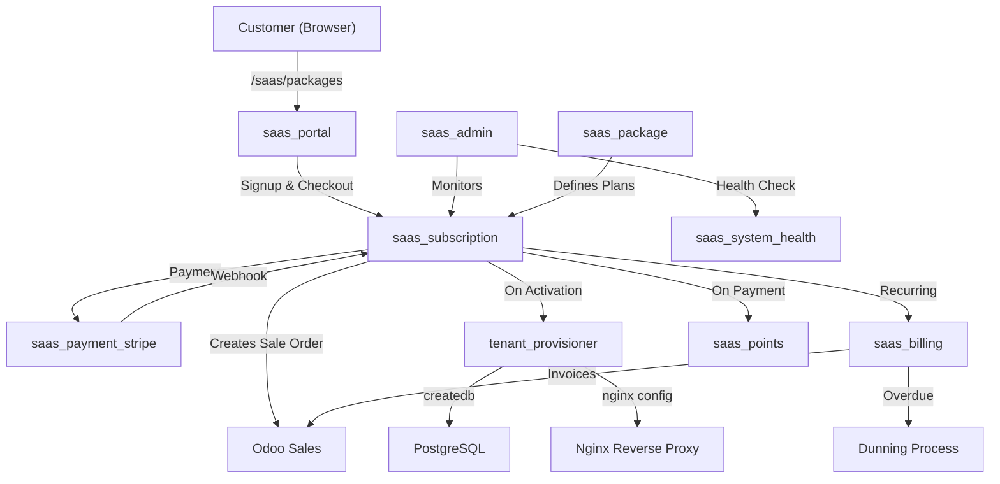
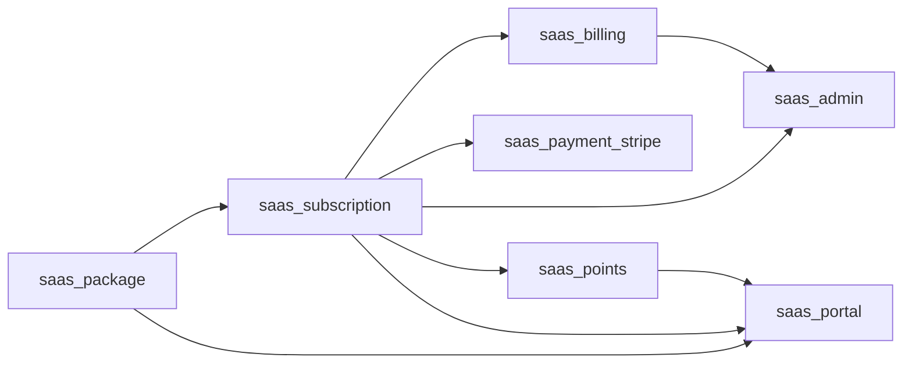
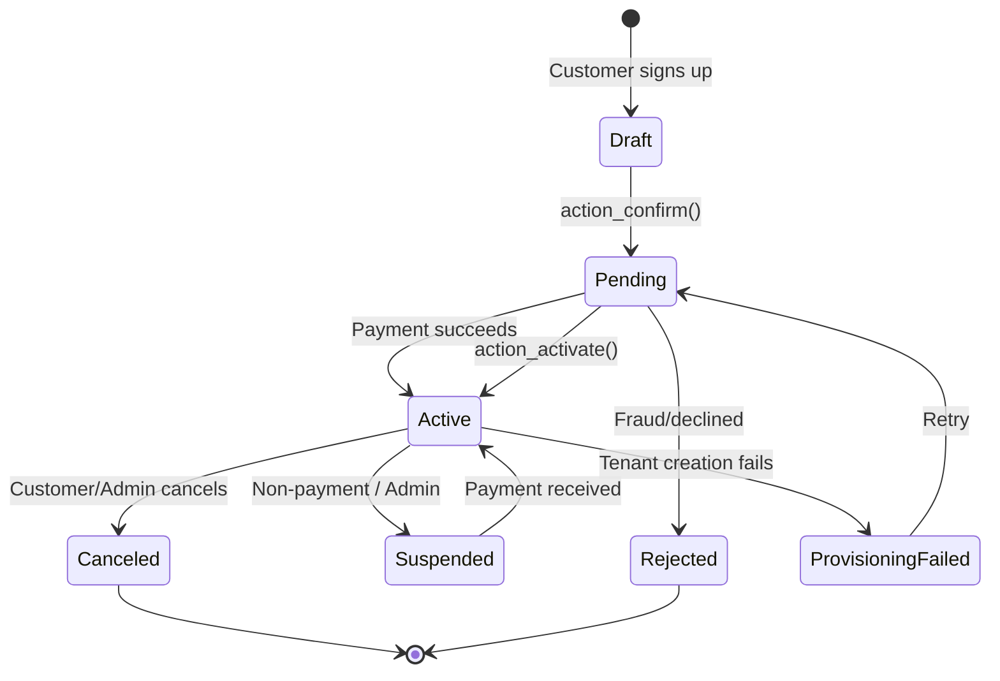
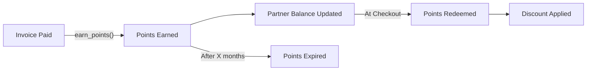

# 🚀 Odoo SaaS Suite — Complete Workflow & Testing Guide

> **Version:** Odoo 18 CE | **Modules:** 7 | **Last Updated:** May 2026

---

## 📋 Table of Contents

1. [Architecture Overview](#1-architecture-overview)
2. [Module Dependency Map](#2-module-dependency-map)
3. [System Parameters (Configuration)](#3-system-parameters-configuration)
4. [Phase 1: Package Setup](#4-phase-1-package-setup)
5. [Phase 2: Customer Signup & Subscription](#5-phase-2-customer-signup--subscription)
6. [Phase 3: Payment Processing (Stripe)](#6-phase-3-payment-processing-stripe)
7. [Phase 4: Tenant Provisioning](#7-phase-4-tenant-provisioning)
8. [Phase 5: Recurring Billing](#8-phase-5-recurring-billing)
9. [Phase 6: Dunning & Late Fees](#9-phase-6-dunning--late-fees)
10. [Phase 7: Loyalty Points](#10-phase-7-loyalty-points)
11. [Phase 8: Admin Dashboard & Operations](#11-phase-8-admin-dashboard--operations)
12. [Phase 9: Customer Portal](#12-phase-9-customer-portal)
13. [Cron Jobs Reference](#13-cron-jobs-reference)
14. [Complete Testing Checklist](#14-complete-testing-checklist)
15. [Troubleshooting](#15-troubleshooting)

---

## 1. Architecture Overview



### Module Roles

| Module | Role | Key Models |
|--------|------|------------|
| **saas_package** | Define SaaS plans with pricing, features, modules | `saas.package`, `saas.package.feature`, `saas.discount` |
| **saas_subscription** | Core subscription lifecycle + tenant provisioning | `saas.subscription`, `tenant.provisioner`, `saas.subscription.log` |
| **saas_billing** | Automated recurring invoicing + dunning | `saas.invoice.scheduler`, `saas.dunning.process`, `saas.late.fee` |
| **saas_payment_stripe** | Stripe Checkout, webhooks, saved card charging | `stripe.config`, `stripe.webhook` (extends `saas.subscription`) |
| **saas_points** | Loyalty points earn/redeem/expire system | `saas.points.transaction`, `saas.partner.points`, `saas.points.config` |
| **saas_portal** | Public landing page + customer self-service portal | Controllers only (extends Odoo Portal) |
| **saas_admin** | Admin dashboard, bulk actions, system health | `saas.system.health`, `admin.force.action.wizard`, `admin.tenant.delete.wizard` |

---

## 2. Module Dependency Map



> [!IMPORTANT]
> **Install order matters!** Install in this order:
> `saas_package` → `saas_subscription` → `saas_billing` → `saas_points` → `saas_payment_stripe` → `saas_portal` → `saas_admin`

---

## 3. System Parameters (Configuration)

Before testing, configure these in **Settings → Technical → Parameters → System Parameters**:

### Required Parameters

| Key | Default Value | Description |
|-----|--------------|-------------|
| `saas.domain_base` | `saas.yourdomain.com` | Base domain for tenant URLs |
| `saas.template_db_name` | `template_odoo` | PostgreSQL template database name |
| `saas.odoo_bin_path` | `/usr/bin/odoo` | Path to Odoo binary |
| `saas.odoo_config_path` | `/etc/odoo/odoo.conf` | Path to Odoo config file |
| `saas.nginx_config_dir` | `/etc/nginx` | Nginx config directory |

### Stripe Parameters (set via wizard)

| Key | Description |
|-----|-------------|
| `saas.stripe.secret_key` | Stripe API Secret Key (`sk_test_...`) |
| `saas.stripe.publishable_key` | Stripe Publishable Key (`pk_test_...`) |
| `saas.stripe.webhook_secret` | Webhook signing secret (`whsec_...`) |

### Points Parameters (set via wizard)

| Key | Default | Description |
|-----|---------|-------------|
| `saas.points.multiplier` | `1.0` | Points earned per currency unit |
| `saas.points.expiry_months` | `12` | Months before points expire |
| `saas.points.min_redemption` | `100` | Minimum points to redeem |
| `saas.points.value_per_unit` | `0.01` | Monetary value per point |
| `saas.points.max_discount_percent` | `50` | Max discount % from points |

### Billing Parameters

| Key | Default | Description |
|-----|---------|-------------|
| `saas.late_fee_percent` | `5` | Late fee percentage on overdue invoices |

---

## 4. Phase 1: Package Setup

### 4.1 Navigate to Package Management

1. Go to **SaaS → Packages** (top menu bar)
2. Click **"New"** to create a package

### 4.2 Fill Package Details

| Field | Example Value | Notes |
|-------|--------------|-------|
| Package Name | `Starter Plan` | Required, translatable |
| Description | `Perfect for small businesses...` | Shows on landing page |
| Monthly Price | `29.99` | Required |
| Yearly Price | `299.99` | Required |
| Setup Fee | `0.00` | One-time fee |
| Mark as Popular | ☑ | Shows "Popular" badge |
| Sequence | `10` | Order in listing |

### 4.3 Add Features (One2many tab)

Click **"Add a line"** under Features:

| Feature Name | Icon |
|-------------|------|
| `5 Users` | `fa-users` |
| `10 GB Storage` | `fa-database` |
| `Email Support` | `fa-envelope` |
| `Custom Domain` | `fa-globe` |

### 4.4 Select Modules

In the **Selected Modules** field, pick which Odoo modules will be installed in tenant databases (e.g., `sale`, `purchase`, `account`, `crm`).

### 4.5 Add Discounts (Optional)

| Field | Value |
|-------|-------|
| Discount Type | `Percentage` or `Fixed Amount` |
| Value | `10` (10% off or $10 off) |
| Valid From | Today |
| Valid To | End of promotion |

> [!TIP]
> Create at least **3 packages** (e.g., Starter, Professional, Enterprise) for a realistic test. Mark one as "Popular".

### 4.6 Testing Checkpoint

- ✅ Navigate to **SaaS → Packages** — all packages visible in list/kanban view
- ✅ Open a package form — all fields editable
- ✅ Duplicate package works (button in form)
- ✅ Archive/Unarchive works

---

## 5. Phase 2: Customer Signup & Subscription

### 5.1 The Subscription Lifecycle



### 5.2 Manual Subscription Creation (Backend)

1. Go to **SaaS → Subscriptions** → **New**
2. Fill in:
   - **Customer**: Select or create a `res.partner`
   - **Package**: Select a package created in Phase 1
   - **Billing Cycle**: Monthly or Yearly
3. Click **"Confirm"** button → State changes to **Pending**
   - A `sale.order` is automatically created and confirmed
   - A service product `"SaaS Subscription"` is auto-created if not existing
4. Click **"Activate"** → State changes to **Active**
   - This triggers `_trigger_provisioning()` (tenant database creation)

### 5.3 Customer Self-Service Signup (Frontend)

1. Visit `http://localhost:8069/saas/packages`
   - Public landing page showing all active packages
2. Click **"Choose Plan"** on a package → Redirects to `/saas/signup`
3. Fill signup form:
   - Name, Email, Password, Company Name, Phone
4. On submit:
   - A `res.partner` + `res.users` is created
   - A `saas.subscription` in **Draft** state is created
   - `action_confirm()` is called → moves to **Pending**
   - User is auto-logged in
   - Redirects to `/saas/checkout`

### 5.4 Subscription Reference Format

Auto-generated sequence: `SUB/0001`, `SUB/0002`, etc.
(Defined in `ir.sequence` with code `saas.subscription`)

### 5.5 Testing Checkpoint

- ✅ Create subscription manually in backend → Sale Order created
- ✅ State buttons work: Confirm → Activate → Suspend → Cancel
- ✅ State change logs appear in the **Logs** tab
- ✅ Chatter shows email notifications for each state change

---

## 6. Phase 3: Payment Processing (Stripe)

> [!WARNING]
> Stripe integration requires the `stripe` Python library. Install it in Odoo's Python:
> ```
> "C:\Program Files\Odoo 18.0.20250721\python\python.exe" -m pip install stripe
> ```

### 6.1 Configure Stripe

1. Go to **SaaS → Configuration → Stripe Configuration** (or navigate via menu)
2. Enter:
   - **Secret Key**: `sk_test_...` (from Stripe Dashboard → Developers → API Keys)
   - **Publishable Key**: `pk_test_...`
   - **Webhook Secret**: `whsec_...` (see 6.3)
3. Click **Save** — the wizard validates the key against Stripe API

### 6.2 Checkout Flow

When a customer reaches `/saas/checkout`:

1. Order summary is displayed (package + setup fee - points discount)
2. Optional: Redeem loyalty points for discount
3. Click **Pay** → `create_stripe_checkout_session()` is called
4. Customer is redirected to Stripe's hosted checkout page
5. On success → redirected to `/saas/payment/success`
6. Stripe sends webhook → subscription activated

### 6.3 Webhook Setup

1. In Stripe Dashboard → **Developers → Webhooks**
2. Add endpoint URL: `https://yourdomain.com/saas/stripe/webhook`
3. Select events to listen for:
   - `checkout.session.completed`
   - `invoice.payment_succeeded`
   - `invoice.payment_failed`
   - `customer.subscription.deleted`
   - `payment_intent.succeeded`
   - `payment_intent.payment_failed`
4. Copy the **Signing Secret** → paste in Stripe Config wizard

### 6.4 Webhook Processing

| Stripe Event | Odoo Action |
|-------------|-------------|
| `checkout.session.completed` | Activates subscription, saves payment method |
| `invoice.payment_succeeded` | Registers payment on Odoo invoice, reactivates if suspended |
| `invoice.payment_failed` | Suspends active subscription |
| `customer.subscription.deleted` | Cancels Odoo subscription |
| `payment_intent.succeeded` | Registers payment on linked invoice |
| `payment_intent.payment_failed` | Adds error reason to subscription |

### 6.5 Stripe Customer Sync

- Each `res.partner` gets a `stripe_customer_id` field
- `get_or_create_stripe_customer()` creates a Stripe Customer on first checkout
- Saved payment methods stored as `stripe_payment_method_id` on subscription
- Used for automatic renewal charging via `charge_saved_payment_method()`

### 6.6 Testing Checkpoint (Test Mode)

- ✅ Configure Stripe with test keys
- ✅ Use Stripe test card: `4242 4242 4242 4242` (any future exp, any CVC)
- ✅ After checkout → subscription moves to Active
- ✅ Webhook logs visible in **SaaS → Configuration → Stripe Webhooks**
- ✅ For local testing, use [Stripe CLI](https://stripe.com/docs/stripe-cli) to forward webhooks:
  ```bash
  stripe listen --forward-to localhost:8069/saas/stripe/webhook
  ```

---

## 7. Phase 4: Tenant Provisioning

> [!CAUTION]
> This phase requires a **Linux server** with PostgreSQL `createdb` permissions, Nginx, and Odoo CLI access. It will NOT work on a local Windows dev machine as-is. For local testing, subscriptions can be activated manually.

### 7.1 How It Works

When a subscription moves to **Active** (via payment or admin action):

1. `_trigger_provisioning()` is called
2. Creates a `tenant.provisioner` record in **Provisioning** state
3. Executes these steps sequentially:

| Step | Action | Command/Method |
|------|--------|----------------|
| 1 | Generate tenant ID | MD5 hash of subscription + timestamp |
| 2 | Generate secure password | 24-char random string |
| 3 | Create PostgreSQL DB | `createdb -T template_odoo tenant_XXXX` |
| 4 | Configure tenant DB | SQL: Set `web.base.url`, company name, email |
| 5 | Install modules | `odoo -d tenant_XXXX --update module1,module2 --stop-after-init` |
| 6 | Create admin user | SQL INSERT into `res_users` |
| 7 | Configure Nginx | Write `.conf` file, symlink, `nginx -s reload` |
| 8 | Update subscription | Set `tenant_url`, `tenant_db_name`, `provisioned_at` |
| 9 | Send credentials email | Template with domain + admin password |

### 7.2 If Provisioning Fails

- Provisioner record moves to **Failed** state
- Error message is stored
- Subscription moves to **Provisioning Failed**
- Database is rolled back (`dropdb --if-exists`)
- Admin can retry via **"Retry Provisioning"** button

### 7.3 Prerequisite: Template Database

You need a **template Odoo database** that serves as the base for all tenants:

```bash
# Create a clean Odoo database as template
createdb template_odoo
odoo -d template_odoo --init base --stop-after-init --no-http
# Then set it as a template:
psql -c "UPDATE pg_database SET datistemplate = true WHERE datname = 'template_odoo';"
```

### 7.4 Testing Checkpoint

- ✅ Provisioner records appear in **SaaS → Provisioning Queue**
- ✅ On local Windows: Manually activate subscription (skip provisioning)
- ✅ On Linux server: Full provisioning pipeline works

---

## 8. Phase 5: Recurring Billing

### 8.1 How Automated Invoicing Works

A **cron job** (`_cron_generate_recurring_invoices`) runs daily:

1. Finds all subscriptions where `state = 'active'` AND `date_next_invoice <= today`
2. For each subscription:
   - Creates `saas.invoice.scheduler` record
   - Generates an `account.move` (invoice) with the package price
   - Posts the invoice
   - Updates `date_next_invoice` (+30 days or +365 days)
   - Sends invoice email

### 8.2 Invoice Scheduler States

| State | Meaning |
|-------|---------|
| Draft | Scheduled but not processed |
| Processing | Currently generating invoice |
| Completed | Invoice generated successfully |
| Failed | Error occurred (see `error_message`) |

### 8.3 Testing Recurring Billing

1. Create an active subscription with `date_next_invoice = today`
2. **Manually trigger** the cron:
   - Settings → Technical → Automation → Scheduled Actions
   - Find **"Generate Recurring Invoices"** → click **"Run Manually"**
3. Check: Invoice created in **Invoicing → Invoices**
4. Check: `date_next_invoice` advanced by 30/365 days
5. Check: `saas.invoice.scheduler` record in **Completed** state

---

## 9. Phase 6: Dunning & Late Fees

### 9.1 Dunning Escalation Timeline

| Days Overdue | Level | Action |
|-------------|-------|--------|
| 2+ days | Level 1 | Friendly reminder email sent |
| 5+ days | Level 2 | Second reminder + **Late fee applied** (5% default) |
| 8+ days | Level 3 | Final warning email — "service will be suspended" |
| 9+ days | Suspended | Subscription auto-suspended, suspension email sent |

### 9.2 Late Fee Mechanism

- When dunning reaches Level 2, `_apply_late_fee()` runs
- Creates a separate `account.move` for the late fee
- Late fee = `invoice.amount_total × saas.late_fee_percent / 100`
- Uses auto-created "Late Fee" service product

### 9.3 Testing Dunning

1. Create an active subscription
2. Generate an invoice with `invoice_date_due` = 10 days ago
3. Leave it unpaid
4. Run cron: **"Process Dunning"** manually
5. Check:
   - ✅ `saas.dunning.process` record created
   - ✅ Dunning level advances based on days overdue
   - ✅ Late fee invoice generated at Level 2
   - ✅ Subscription suspended at 9+ days

---

## 10. Phase 7: Loyalty Points

### 10.1 How Points Work



### 10.2 Point Earning

- Triggered when an invoice is marked as **paid**
- Points = `invoice.amount_untaxed × points_multiplier`
- Each earned transaction has an **expiry date** (default: 12 months)
- Duplicate earning is prevented (one earn per invoice)

### 10.3 Point Redemption

- At checkout (`/saas/checkout`), customer can enter points to redeem
- Discount = `redeemed_points × points_value_per_unit`
- Minimum redemption threshold applies (`min_points_redemption`)
- Maximum discount capped at `max_discount_percent` of total

### 10.4 Point Expiry

- Cron job `_cron_expire_points` runs periodically
- Finds earned points past their `expiry_date`
- Creates negative "expire" transaction to zero them out
- Updates partner balance

### 10.5 Configure Points System

1. Go to **SaaS → Configuration → Points Configuration**
2. Set multiplier, expiry months, min redemption, value per unit
3. Click **Save**

### 10.6 Testing Points

1. Create a subscription → Generate and pay an invoice
2. Check: `saas.points.transaction` created with positive points
3. Check: `saas.partner.points` balance updated
4. At checkout: Enter points to redeem → verify discount calculated
5. Run expiry cron → verify expired points deducted

---

## 11. Phase 8: Admin Dashboard & Operations

### 11.1 SaaS Dashboard (Kanban)

Navigate to **SaaS → Dashboard** to see:

- Active Subscriptions count
- Pending Provisioning count
- Failed Invoices count
- CPU/Memory/Disk usage (requires `psutil`)
- System health status: Healthy / Warning / Critical

### 11.2 System Health Monitor

Navigate to **SaaS → Admin Actions → System Health**:

- View historical health check records
- Cron runs hourly (`_cron_check_health`)
- Alerts sent when status is **Critical** (disk > 95%, etc.)

### 11.3 Admin Bulk Actions

Select subscriptions in list view → **Action → Force Action**:

| Action | Effect |
|--------|--------|
| Force Activate | Bypasses payment, activates subscription |
| Force Suspend | Immediately blocks tenant access |
| Force Cancel | Terminates subscription |
| Retry Provisioning | Re-queues failed provisioning |

### 11.4 Tenant Deletion Wizard

From a subscription form with a provisioned tenant:
- Click **"Delete Tenant"** button
- Confirm with checkbox + provide reason
- Drops PostgreSQL database permanently

### 11.5 Testing Admin

- ✅ Dashboard shows correct counts
- ✅ Bulk action wizard opens from subscription list
- ✅ Force Activate works on pending subscription
- ✅ System Health records appear after running cron

---

## 12. Phase 9: Customer Portal

### 12.1 Portal Routes

| URL | Auth | Description |
|-----|------|-------------|
| `/saas/packages` | Public | Landing page with all packages |
| `/saas/signup?package_id=X` | Public | Registration form |
| `/saas/checkout` | User | Order summary + payment |
| `/saas/activation/<id>` | User | Provisioning status (AJAX polling) |
| `/my/subscriptions` | User | List of customer's subscriptions |
| `/my/subscriptions/<id>` | User | Subscription detail + invoices + points |
| `/my/subscriptions/<id>/cancel` | User (POST) | Cancel subscription |
| `/my/subscriptions/<id>/reactivate` | User (POST) | Reactivate → checkout |
| `/my/invoices` | User | List all invoices |
| `/my/invoices/<id>/pdf` | User | Download invoice PDF |
| `/my/points` | User | Points balance + transaction history |

### 12.2 Testing Portal

1. Login as a customer (not admin)
2. Visit `/my/subscriptions` → verify subscription list appears
3. Click a subscription → verify detail page with invoices and points
4. Visit `/my/points` → verify balance and transactions
5. Visit `/saas/packages` (logged out) → verify public listing

---

## 13. Cron Jobs Reference

| Cron Job | Module | Frequency | Method |
|----------|--------|-----------|--------|
| Generate Recurring Invoices | `saas_billing` | Daily | `_cron_generate_recurring_invoices()` |
| Sync Missing Invoices | `saas_billing` | Daily | `_cron_sync_missing_invoices()` |
| Process Dunning | `saas_billing` | Daily | `_cron_process_dunning()` |
| Cleanup Resolved Dunning | `saas_billing` | Weekly | `_cron_cleanup_resolved_dunning()` |
| Expire Points | `saas_points` | Daily | `_cron_expire_points()` |
| System Health Check | `saas_admin` | Hourly | `_cron_check_health()` |

> [!TIP]
> To test any cron: **Settings → Technical → Scheduled Actions** → Find the cron → **Run Manually**

---

## 14. Complete Testing Checklist

### Phase 1: Setup ✅
- [ ] Create 3 packages (Starter, Pro, Enterprise)
- [ ] Add features and pricing to each
- [ ] Mark one as "Popular"
- [ ] Set system parameters (`saas.domain_base`, etc.)

### Phase 2: Subscription ✅
- [ ] Create subscription manually in backend
- [ ] Verify Sale Order auto-created on Confirm
- [ ] Test all state transitions (Confirm → Activate → Suspend → Cancel)
- [ ] Verify state change logs

### Phase 3: Payment ✅
- [ ] Configure Stripe test keys
- [ ] Visit `/saas/packages` → select package → signup → checkout
- [ ] Complete Stripe test payment (card: `4242 4242 4242 4242`)
- [ ] Verify webhook processes correctly
- [ ] Verify subscription activated after payment

### Phase 4: Billing ✅
- [ ] Set `date_next_invoice` to today on an active subscription
- [ ] Run recurring invoice cron manually
- [ ] Verify invoice created and posted
- [ ] Verify `date_next_invoice` advanced

### Phase 5: Dunning ✅
- [ ] Create overdue unpaid invoice (due date 10 days ago)
- [ ] Run dunning cron
- [ ] Verify escalation levels applied
- [ ] Verify late fee invoice created at Level 2
- [ ] Verify subscription suspended at 9+ days

### Phase 6: Points ✅
- [ ] Register payment on an invoice
- [ ] Verify points transaction created
- [ ] Verify partner balance updated
- [ ] Test points redemption at checkout
- [ ] Run expiry cron with old points

### Phase 7: Admin ✅
- [ ] View SaaS Dashboard kanban
- [ ] Run System Health Check cron
- [ ] Test bulk Force Action wizard
- [ ] Verify health records in list view

### Phase 8: Portal ✅
- [ ] Visit `/saas/packages` as public user
- [ ] Visit `/my/subscriptions` as logged-in customer
- [ ] Visit `/my/points` — verify balance
- [ ] Test cancel/reactivate from portal

---

## 15. Troubleshooting

### Common Issues

| Issue | Solution |
|-------|----------|
| `View type is not defined tree` | Upgrade modules — Odoo 18 uses `list` not `tree` |
| `External ID not found` | Check manifest `data` file load order |
| `Element odoo has extra content` | XML schema issue — remove bare `<data>` tags or deprecated attributes |
| `psutil` not found | `pip install psutil` in Odoo's Python |
| `stripe` not found | `pip install stripe` in Odoo's Python |
| `cryptography` not found | `pip install cryptography` in Odoo's Python |
| Provisioning fails on Windows | Expected — provisioning uses Linux commands (`createdb`, `nginx`). Use manual activation. |
| Webhook not received | Use Stripe CLI: `stripe listen --forward-to localhost:8069/saas/stripe/webhook` |

### Upgrading Modules After Code Changes

```
# From Odoo's Settings → Apps → Update Apps List
# Then find the module → Upgrade
# Or via CLI:
odoo -d YOUR_DB -u saas_package,saas_subscription,saas_billing --stop-after-init
```

> [!NOTE]
> After any XML file changes (views, menus, actions), you **must upgrade** the module for changes to take effect in the database. Simply restarting Odoo is not enough for already-installed modules.

---

## Quick Start Summary

```
1. Install modules in order
2. Configure System Parameters (domain, paths)
3. Configure Stripe (test keys)
4. Create 3 Packages with features
5. Create a test Subscription (backend)
6. Confirm → Activate → Verify Sale Order + Invoice
7. Test Portal as customer (/my/subscriptions)
8. Run crons manually to test billing + dunning
9. Check Admin Dashboard
```

**You're now ready to operate your SaaS platform! 🎉**
