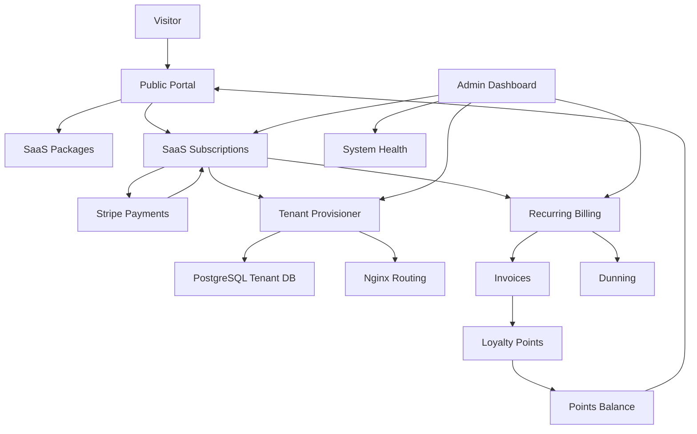
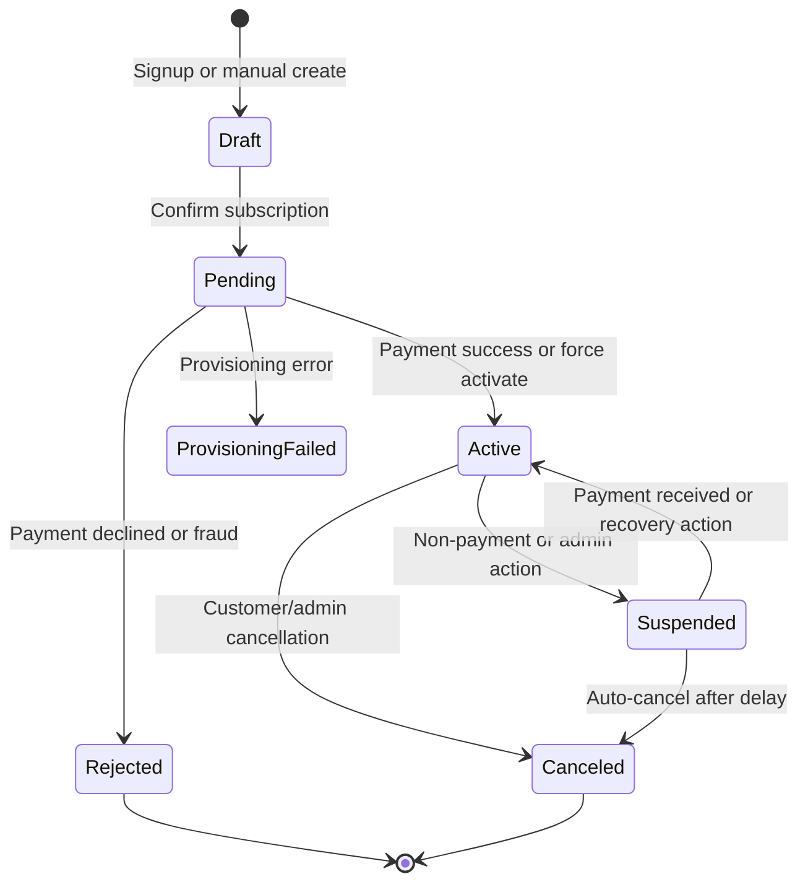

# Custom SaaS Kit - Client-Ready Architecture and Validation Guide

> Odoo 18 CE | Seven connected modules | Prepared for client review and operational handoff

## Executive Summary
The Custom SaaS Kit is a complete SaaS operating suite built on Odoo. It connects package catalog management, subscription lifecycle control, Stripe payment collection, tenant provisioning, recurring billing, dunning, loyalty points, customer portal access, and administrative recovery into one continuous workflow.

At a practical level, the suite turns a package selection into a paid subscription, a provisioned tenant, a recurring billing relationship, and a managed customer experience. The design supports both automated execution and manual admin intervention when something needs to be corrected.

## Suite Architecture

## Module Roles

### 1. `saas_package`
Defines the commercial offer.

It stores:
- package name and description
- monthly and yearly pricing
- setup fee
- package features
- included Odoo modules
- active and popular flags
- discount rules

This module is the source of truth for what is sold and what the tenant should include.

### 2. `saas_subscription`
Controls the subscription lifecycle.

It manages:
- draft, pending, active, suspended, canceled, rejected, and provisioning_failed states
- sale order creation
- next invoice date logic
- state-change logging
- tenant database references
- tenant password encryption
- portal actions such as renew, pay now, and view invoices

This is the central control plane of the whole suite.

### 3. `saas_payment_stripe`
Handles payment collection and payment event synchronization.

It provides:
- Stripe configuration
- Stripe customer creation on partner records
- Stripe checkout sessions
- webhook processing
- saved payment method support
- invoice payment registration

This module is the payment bridge between Stripe and Odoo.

### 4. `saas_billing`
Handles recurring invoicing and overdue payment handling.

It provides:
- invoice scheduling
- invoice generation
- invoice email notifications
- dunning escalation
- late fee processing
- dunning cleanup

This module keeps the subscription financially active after the initial sale.

### 5. `saas_points`
Implements loyalty points.

It provides:
- points earned from paid invoices
- redemption at checkout
- expiry processing
- partner balance tracking
- transaction history

This module improves customer retention and provides controlled discounts on future renewals.

### 6. `saas_portal`
Exposes the customer-facing experience.

It provides:
- public package listing
- signup form
- checkout flow
- provisioning status page
- subscription self-service pages
- invoice and points views

This module is the customer acquisition and self-service layer.

### 7. `saas_admin`
Provides the operational console.

It provides:
- dashboard metrics
- system health monitoring
- bulk force actions
- tenant deletion wizard
- retry and recovery controls

This module is the support and recovery layer for operators.

## End-to-End Functional Workflow

### Step 1: Packages are created
An administrator creates SaaS packages with pricing, feature lists, and module selections.

### Step 2: The customer selects a plan
A visitor opens the public package page, reviews the offers, and starts the signup process.

### Step 3: The account and subscription are created
The system creates the customer partner, user account, and subscription record. The subscription is confirmed into pending payment.

### Step 4: Payment is completed
The customer pays through Stripe checkout. Stripe events confirm the payment and return the result to Odoo.

### Step 5: The subscription becomes active
Once payment succeeds, the subscription is activated.

### Step 6: Tenant provisioning begins
The provisioning engine creates the tenant database, applies configuration, installs the selected modules, and writes the tenant routing setup.

### Step 7: The customer receives access
The system stores the tenant URL and credentials and sends the onboarding email.

### Step 8: Recurring billing continues the relationship
When the billing date arrives, the invoice scheduler creates a renewal invoice and updates the next billing date.

### Step 9: Dunning protects revenue
If the invoice remains unpaid, reminders are sent, late fees may be added, and the subscription may be suspended.

### Step 10: Loyalty points reward payments
Paid invoices generate points, and those points can later be redeemed for discounts.

### Step 11: Admins monitor and recover
The admin dashboard and health monitor provide visibility into subscription state, failed billing, provisioning issues, and server health.

## Subscription State Journey

## Data Flow Summary
- Package data defines price and tenant contents.
- Subscription state drives payment, provisioning, billing, and portal visibility.
- Stripe webhooks update payment outcomes and can activate or suspend subscriptions.
- Billing creates invoices and advances the renewal date.
- Dunning escalates overdue accounts.
- Paid invoices feed the points ledger.
- Portal pages read live subscription, invoice, and points data.
- Admin tools provide recovery when automation is not enough.

## Configuration Required Before Testing
Before running the suite, configure the following system parameters and supporting values:

- domain base for tenant URLs
- PostgreSQL template database name
- Odoo binary path
- Odoo config path
- Nginx config directory
- Stripe secret key
- Stripe publishable key
- Stripe webhook secret
- points multiplier
- points expiry period
- minimum redemption threshold
- point value per unit
- maximum discount percentage
- late fee percentage

## Full Validation Runbook
This is the recommended end-to-end test sequence to validate the suite from scratch.

### Phase 1: Package setup
1. Create at least three packages, such as Starter, Professional, and Enterprise.
2. Add monthly and yearly pricing.
3. Add setup fees where needed.
4. Add package features and included modules.
5. Mark one package as popular.
6. Add at least one active discount window.

Expected result:
- packages appear correctly in the admin views
- feature and discount tabs save properly
- duplicate and archive behavior works

### Phase 2: Subscription creation
1. Create a subscription manually from the backend.
2. Confirm the subscription.
3. Verify the sale order is created and confirmed.
4. Check that the state becomes pending.
5. Verify the state change is logged.

Expected result:
- the subscription reference is generated
- the sales record is linked
- the log tab shows the transition

### Phase 3: Public signup
1. Visit the public package page.
2. Start a signup from a package.
3. Submit a valid customer account.
4. Confirm the subscription lands in pending payment.
5. Check that the customer session is authenticated.

Expected result:
- partner and user are created
- the subscription is created automatically
- the customer lands on checkout

### Phase 4: Stripe payment
1. Configure Stripe test keys.
2. Use the checkout page to pay for a subscription.
3. Confirm the checkout session is created.
4. Complete the Stripe hosted payment.
5. Verify the webhook reaches Odoo.

Expected result:
- checkout succeeds
- the webhook log is created
- the subscription becomes active

### Phase 5: Tenant provisioning
1. Activate a subscription that is ready for provisioning.
2. Confirm the provisioning engine creates the tenant record.
3. Verify the tenant database name and tenant URL are stored.
4. Confirm the credentials email is sent.
5. On Linux, verify Nginx and PostgreSQL actions succeed.

Expected result:
- tenant provisioning ends in completed
- subscription stores the tenant data
- failed provisioning moves to provisioning_failed with a retry path

### Phase 6: Recurring billing
1. Set an active subscription so the next invoice date is due.
2. Run the recurring billing cron manually.
3. Verify the invoice is created and posted.
4. Verify the next invoice date moves forward.

Expected result:
- scheduler record becomes completed
- invoice appears in accounting
- renewal date is updated

### Phase 7: Dunning and late fees
1. Create or locate an overdue unpaid invoice.
2. Run the dunning cron.
3. Verify reminder stages are applied.
4. Verify the late fee is created at the correct stage.
5. Verify the subscription suspends after the threshold.

Expected result:
- dunning process records are created
- late fee logic runs only once
- suspension happens at the final stage

### Phase 8: Loyalty points
1. Pay an invoice.
2. Confirm points are earned.
3. Check the partner balance.
4. Use checkout again and redeem points.
5. Run the points expiry cron for old points.

Expected result:
- a positive points transaction is recorded
- balance updates automatically
- redeemed points reduce the payable amount
- expired points are removed by ledger entries

### Phase 9: Admin control
1. Open the admin dashboard.
2. Review subscription totals and health data.
3. Use the force action wizard on a test subscription.
4. Retry provisioning on a failed tenant.
5. Open the tenant deletion wizard on a test tenant.

Expected result:
- bulk actions execute correctly
- health status is visible
- destructive tenant deletion is gated by confirmation

## Operational Notes
- Full tenant provisioning requires a Linux environment with PostgreSQL and Nginx access.
- Stripe payment testing should use test keys and test card numbers only.
- Some operations are intentionally recoverable by admin intervention.
- The chatter and log records are part of the audit trail and should be checked during validation.
- Module upgrade is required after XML view or menu changes.

## Recommended Reading Order for Teams
For a quick internal understanding, read the codebase in this order:
1. `saas_package`
2. `saas_subscription`
3. `tenant.provisioner`
4. `saas_payment_stripe`
5. `saas_billing`
6. `saas_points`
7. `saas_portal`
8. `saas_admin`

## Closing Summary
The suite behaves as a single SaaS operating engine. Packages define the offer, subscriptions control the customer lifecycle, Stripe handles payment, provisioning creates the tenant, billing keeps the service renewed, dunning protects revenue, points reward good payment behavior, the portal serves the customer, and the admin dashboard keeps the platform under control.
