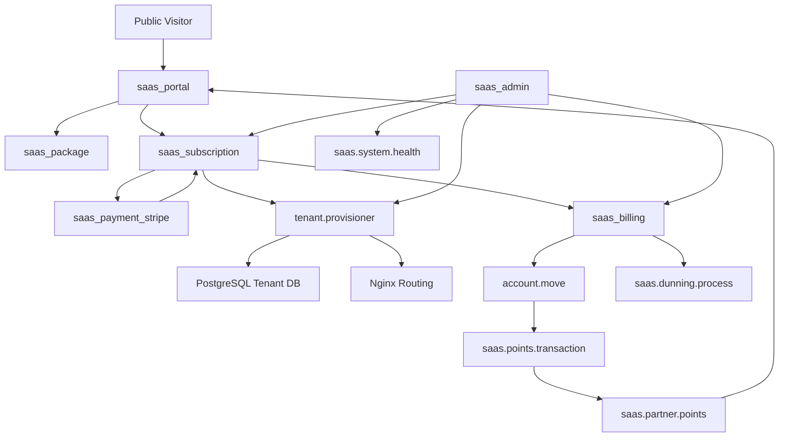
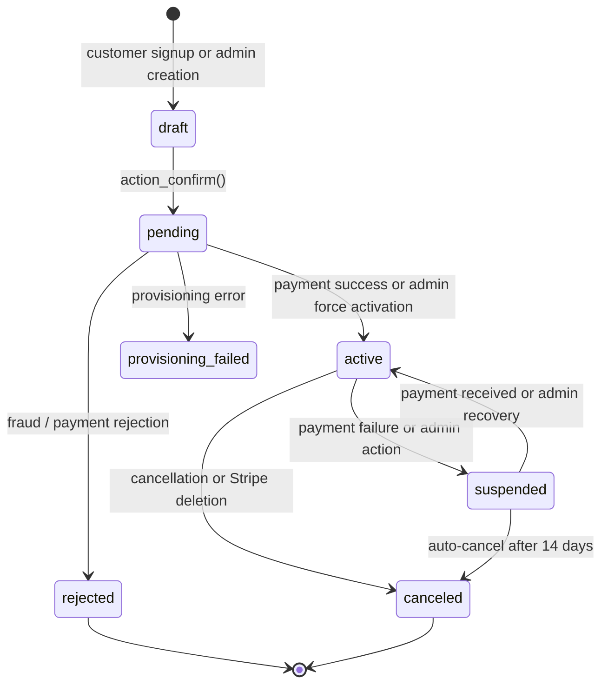
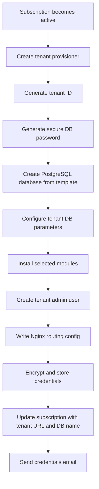

# Odoo SaaS Kit - Full Architecture and Functional Workflow Guide

> Version: Odoo 18 CE | Modules: 7 | Based on the current codebase

## Purpose
This document describes the full functional architecture of the Custom SaaS Kit, including how the seven modules interact, how data moves through the system, how subscriptions are provisioned, how billing and points are processed, how the customer portal behaves, and how admins operate and recover the platform.

## 1. Suite Overview
The suite is organized as a layered SaaS operating model built on Odoo:

- `saas_package` defines what is sold.
- `saas_subscription` defines who bought it and controls the subscription lifecycle.
- `saas_payment_stripe` collects payment and synchronizes Stripe events back into Odoo.
- `saas_billing` generates recurring invoices and handles dunning.
- `saas_points` rewards customer payment behavior and supports redemption.
- `saas_portal` exposes public signup and customer self-service pages.
- `saas_admin` gives operators dashboard visibility and corrective controls.

The system is designed so a package selection becomes a subscription, a payment, a tenant database, a recurring billing relationship, and finally a managed customer instance with a visible service lifecycle.

## 2. High-Level Architecture

## 3. Module Dependency Map
The effective dependency order is:

1. `saas_package`
2. `saas_subscription`
3. `saas_billing`
4. `saas_points`
5. `saas_payment_stripe`
6. `saas_portal`
7. `saas_admin`

This order matters because each later module extends behavior established by the earlier ones.

## 4. Module Responsibilities

### 4.1 saas_package
This module defines the commercial catalog.

Core models:
- `saas.package`
- `saas.package.feature`
- `saas.discount`

Key behavior:
- Stores monthly and yearly pricing.
- Stores setup fee and currency.
- Allows selection of installed Odoo modules for tenant provisioning.
- Stores package features with icon metadata.
- Supports time-bound discounts, coupon codes, and usage limits.
- Tracks package popularity and active status.

Practical role:
- It is the source of truth for what a customer can buy and what capabilities a tenant should receive.

### 4.2 saas_subscription
This is the core lifecycle engine.

Core models:
- `saas.subscription`
- `saas.subscription.log`
- `tenant.provisioner`
- `saas.subscription.auto_expire`
- subscription wizard utilities

Key behavior:
- Manages states: draft, pending, active, suspended, canceled, rejected, provisioning_failed.
- Generates the subscription sequence reference.
- Creates sale orders when a subscription is confirmed.
- Updates next invoice dates based on billing cycle.
- Triggers tenant provisioning when activation occurs.
- Records state transitions in a dedicated log model.
- Encrypts tenant passwords before storing them on the subscription.
- Exposes portal actions such as viewing invoices, paying now, and renewing.

Practical role:
- It is the central control plane for the customer lifecycle and tenant lifecycle.

### 4.3 saas_payment_stripe
This module bridges Odoo and Stripe.

Core models:
- `stripe.config`
- `stripe.webhook`
- extension of `saas.subscription`
- extension of `res.partner`

Key behavior:
- Stores Stripe secret key, publishable key, and webhook signing secret in system parameters.
- Builds Stripe checkout sessions from subscription data.
- Creates Stripe customers on the partner record when needed.
- Stores Stripe customer IDs and payment method references.
- Handles webhook events for checkout completion, invoice payment success/failure, subscription deletion, and payment intent events.
- Registers Odoo payments and updates subscription state in response to Stripe events.

Practical role:
- It is the payment gateway and payment event synchronizer.

### 4.4 saas_billing
This module handles recurring revenue operations.

Core models:
- `saas.invoice.scheduler`
- `saas.dunning.process`
- `saas.late.fee`
- billing mixin utilities

Key behavior:
- Generates recurring invoices for active subscriptions when the next invoice date is due.
- Tracks invoice generation state in a scheduler model.
- Sends invoice emails.
- Applies dunning rules to overdue invoices.
- Creates late fee invoices when escalation reaches the configured threshold.
- Supports cleanup of resolved dunning records.

Practical role:
- It is the renewal engine and collections engine.

### 4.5 saas_points
This module handles loyalty logic.

Core models:
- `saas.points.transaction`
- `saas.partner.points`
- `saas.points.config`
- invoice extension
- partner extension

Key behavior:
- Earns points from paid invoices.
- Tracks balances by partner.
- Supports redemption during checkout.
- Enforces minimum redemption thresholds.
- Expires earned points by cron.
- Recomputes balances from the transaction ledger.

Practical role:
- It is the retention and reward layer.

### 4.6 saas_portal
This module presents the customer-facing experience.

Key routes:
- `/saas/packages`
- `/saas/signup`
- `/saas/checkout`
- `/saas/checkout/pay`
- `/saas/payment/success`
- `/saas/payment/cancel`
- `/saas/activation/<id>`
- `/saas/activation/status/<id>/json`
- `/my/subscriptions`
- `/my/invoices`
- `/my/points`

Key behavior:
- Lists active packages publicly.
- Accepts signup submissions and creates partner, user, and subscription records.
- Shows checkout totals and handles optional points redemption.
- Sends the user into Stripe checkout.
- Displays provisioning status and completion pages.
- Extends the customer portal for self-service.

Practical role:
- It is the customer acquisition and self-service front end.

### 4.7 saas_admin
This module is the operator console.

Core models and utilities:
- `saas.system.health`
- `saas.admin.mixin`
- `saas.subscription.admin`
- `admin.force.action.wizard`
- `admin.tenant.delete.wizard`

Key behavior:
- Shows operational metrics and subscription counts.
- Provides bulk force actions for subscriptions.
- Supports forced retry of provisioning.
- Supports tenant deletion through a destructive confirmation flow.
- Runs system health checks and stores historical health records.
- Sends alerts for critical conditions.

Practical role:
- It is the recovery, monitoring, and control layer.

## 5. Subscription Lifecycle

### 5.1 Draft
A subscription begins in draft when a customer signs up or when an admin creates a record before confirmation.

Important code behavior:
- The subscription gets a generated reference from the sequence.
- The next invoice date is initialized based on billing cycle.
- Draft records can be mailed a welcome notification.

### 5.2 Pending
When `action_confirm()` is called:
- The subscription validates partner and package selection.
- A sale order is created.
- The sale order is confirmed.
- The state changes to pending.
- The next invoice date is refreshed.
- A log entry is recorded.

Pending represents a subscription that is commercially accepted but not yet operationally active.

### 5.3 Active
A subscription becomes active when payment succeeds or when an admin forces activation.

Important effects:
- The record updates its start date.
- Stripe webhook handling may save payment method references.
- Tenant provisioning is triggered when the write path reaches active from pending or suspended.
- The tenant database URL and credentials are stored once provisioning completes.

### 5.4 Suspended
Suspension is used when payment fails or the admin blocks access.

Important effects:
- Date suspended is stamped.
- The reason is stored.
- A notification template may be sent.
- A suspended subscription can later be reactivated by payment or admin intervention.

### 5.5 Canceled
Cancellation ends the service lifecycle.

Important effects:
- The end date is set.
- The canceled timestamp is recorded.
- The reason is stored.
- A tenant may be deleted later by admin wizard.

### 5.6 Rejected
This is used for fraud or invalid payment outcomes.

Important effects:
- The subscription is terminated without progressing to active.
- A rejection email can be sent.

### 5.7 Provisioning Failed
This state captures operational failures during tenant creation.

Important effects:
- The database creation or configuration step failed.
- The system can keep the subscription recoverable.
- Admins can retry provisioning.
- The failed tenant may be rolled back by dropping the partially created database.

## 6. Package and Pricing Flow

### 6.1 Package definition
The package form controls:
- Display name and description.
- Monthly price.
- Yearly price.
- Setup fee.
- Sequence ordering.
- Active status.
- Popular badge.
- Included Odoo modules.
- Feature list with icons.
- Discounts.

### 6.2 Package-to-subscription link
When a customer selects a plan:
- The package record is the source of pricing.
- The package determines which modules are later installed in the tenant database.
- The package features are displayed on the landing page and portal.
- The package discount logic is used when applicable.

### 6.3 Discount logic
Discount records are time-bound and may also be coupon-bound.

Validation rules:
- Valid from must be on or before valid to.
- Percentage discounts must stay between 0 and 100.
- Fixed discounts cannot be negative.

Usage rules:
- A discount may have a usage limit.
- The system selects the best applicable discount by value when multiple are valid.

## 7. Signup and Checkout Flow

### 7.1 Public signup
The customer journey starts on `/saas/packages`.

Flow:
1. Customer sees active packages.
2. Customer selects a package.
3. Customer is directed to `/saas/signup`.
4. The form captures name, email, password, company, and phone.
5. The system creates `res.partner` and `res.users`.
6. A `saas.subscription` is created in draft.
7. `action_confirm()` moves it to pending.
8. The user is authenticated into the session.
9. The user is redirected to checkout.

### 7.2 Checkout page
The checkout page calculates:
- Base package price from monthly or yearly cycle.
- Setup fee.
- Loyalty point discount if redeemed.
- Total payable amount.

The portal passes the subscription ID through session state.

### 7.3 Stripe checkout
When payment is initiated:
- `create_stripe_checkout_session()` is called.
- A Stripe customer is created if missing.
- The checkout session includes recurring price data.
- The session can include a setup fee as a separate line item.
- The customer is redirected to Stripe-hosted checkout.

### 7.4 Stripe webhook return
When Stripe completes checkout:
- Stripe emits webhook events.
- The webhook log is stored in Odoo.
- The subscription is activated.
- The saved payment method may be stored for future use.

## 8. Stripe and Payment Architecture

### 8.1 Stripe configuration
The configuration wizard validates the secret key by calling Stripe account retrieval.

Stored parameters:
- Stripe secret key.
- Stripe publishable key.
- Webhook secret.

Computed value:
- Webhook URL based on the current Odoo base URL.

### 8.2 Partner-level Stripe customer mapping
Each partner can store a Stripe customer ID.

Behavior:
- If a customer already exists, reuse it.
- Otherwise create one through Stripe API.
- Store the result back on the partner.

### 8.3 Subscription-level Stripe fields
The subscription tracks:
- Stripe subscription ID.
- Stripe payment method ID.
- Last payment intent ID.

These values are used for renewals and off-session charging.

### 8.4 Webhook handling
Supported event families:
- `checkout.session.completed`
- `invoice.payment_succeeded`
- `invoice.payment_failed`
- `customer.subscription.deleted`
- `payment_intent.succeeded`
- `payment_intent.payment_failed`

Operational effects:
- Payment success can create or reconcile Odoo payments.
- Payment failure can suspend a subscription.
- Stripe subscription deletion can cancel the Odoo subscription.
- Checkout completion can save payment metadata and activate the service.

### 8.5 Saved payment method charging
The code path supports charging a saved payment method for renewal invoices.

Use case:
- Renewal billing can be automated without forcing the customer back into hosted checkout.
- Failed off-session charges are handled as errors or suspension triggers.

## 9. Tenant Provisioning Architecture

### 9.1 Provisioning trigger
Provisioning is triggered when a subscription is written to active from pending or suspended, or when an admin forces activation.

### 9.2 Provisioner lifecycle
The `tenant.provisioner` model uses states:
- pending
- provisioning
- completed
- failed

### 9.3 Provisioning steps
The engine performs these steps in order:
1. Generate a tenant identifier from subscription and timestamp data.
2. Generate a secure database password.
3. Create a PostgreSQL database from the template database.
4. Configure Odoo parameters inside the tenant database.
5. Install the package-selected modules in that tenant database.
6. Create or reset the tenant admin user.
7. Write and enable an Nginx config for the tenant domain.
8. Encrypt and store tenant credentials on the subscription.
9. Send the tenant credentials email.

### 9.4 Provisioning rollback
If any step fails:
- The provisioner enters failed.
- The subscription enters provisioning_failed.
- The partially created database is dropped if it exists.
- The failure reason is stored.
- Admin can retry from the subscription record.

### 9.5 Environment dependency
The provisioning logic assumes:
- PostgreSQL command-line access.
- createdb and dropdb permissions.
- Odoo CLI access.
- Nginx access.
- Linux server behavior.

This means full provisioning is operationally server-side, not a Windows-local process.

## 10. Billing and Renewal Architecture

### 10.1 Next invoice date logic
The subscription tracks `date_next_invoice`.

Initialization:
- Monthly subscriptions typically move to about 30 days ahead.
- Yearly subscriptions move to about 365 days ahead.

### 10.2 Recurring invoice scheduler
The `saas.invoice.scheduler` model is the renewal ledger.

States:
- draft
- processing
- completed
- failed

Behavior:
- Searches active subscriptions due for invoicing.
- Prevents duplicate scheduling when a processing entry already exists.
- Creates invoice scheduler records.
- Generates invoices.
- Posts invoices.
- Updates the next invoice date.
- Sends invoice emails.

### 10.3 Invoice generation flow
The recurring invoice path:
1. Finds active subscriptions with a due next invoice date.
2. Determines the cycle amount.
3. Creates or reuses a sale order.
4. Generates an invoice from the sale order.
5. Posts the invoice.
6. Stores invoice and amount on the scheduler record.
7. Advances the subscription next invoice date.
8. Sends the invoice notification.

### 10.4 Missing invoice sync
The code includes a secondary pass for catching missed invoice creation windows.

Purpose:
- Repair gaps where a next invoice date passed without a scheduler record.

## 11. Dunning and Late Fee Architecture

### 11.1 Dunning model
`saas.dunning.process` stores one overdue collection context per subscription and invoice.

Key fields:
- overdue days
- dunning level
- last notification timestamp
- late fee flag
- late fee invoice reference
- active/resolved/escalated state

### 11.2 Dunning timeline
The code supports the following escalation pattern:
- Day 2: reminder 1
- Day 5: reminder 2 and late fee application
- Day 8: final warning
- Day 9: suspension

### 11.3 Late fee logic
When late fee applies:
- The late fee percentage is loaded from system parameters.
- The amount is calculated from the overdue invoice total.
- A late fee product is created if missing.
- A late fee invoice is generated and posted.
- The dunning record stores that the fee was applied.

### 11.4 Dunning emails
The system resolves a mail template by severity:
- reminder 1
- reminder 2
- final warning
- suspension

### 11.5 Auto-cancel after suspension
A separate cron path can auto-cancel subscriptions that remain suspended beyond a configured window.

Current behavior in code:
- Suspended subscriptions older than 14 days can be canceled automatically.
- The cancellation reason is stored as auto-canceled after suspension.

## 12. Loyalty Points Architecture

### 12.1 Point earning
Points are earned from paid invoices.

Rules:
- The invoice must be paid.
- The invoice must not already have an earn transaction.
- Points are computed on untaxed amount.
- A multiplier from configuration is applied.
- Earned points receive an expiry date.
- The partner balance is updated from the transaction ledger.

### 12.2 Point redemption
Points may be redeemed during checkout or from payment flows.

Rules:
- Partner must have enough balance.
- Minimum redemption threshold must be met.
- Redemption creates a negative transaction.
- Partner balance is recomputed.

### 12.3 Point expiry
Expired points are handled through cron.

Behavior:
- Find earn transactions whose expiry date has passed.
- Create corresponding negative expire transactions.
- Recompute partner balances.

### 12.4 Points balance model
`saas.partner.points` acts as the customer-facing balance summary.

It stores:
- current balance
- total earned
- total redeemed
- last updated timestamp

### 12.5 Invoice extension
The invoice model exposes points-related fields:
- points earned
- points redeemed
- points discount amount
- subscription linkage

This makes points visible in finance workflows.

## 13. Customer Portal Architecture

### 13.1 Public pages
The public portal provides:
- package listing
- signup form
- checkout page
- payment success and cancel pages
- provisioning status pages

### 13.2 Authenticated self-service pages
Logged-in users can access:
- subscription list
- subscription detail
- invoices
- points history
- cancel and reactivate actions

### 13.3 Portal state reflection
Portal pages are not isolated views; they are direct readouts of the live SaaS state.

Examples:
- Subscription detail reflects invoice and points records.
- Provisioning status reflects the subscription state and tenant URL.
- Checkout reflects live package pricing and points balance.

### 13.4 AJAX status polling
The provisioning status page supports JSON polling.

This is used so the portal can show a live transition from pending or provisioning_failed to active.

## 14. Admin Architecture

### 14.1 Dashboard data
The admin dashboard should expose operational KPIs such as:
- total subscriptions
- active subscriptions
- suspended subscriptions
- pending subscriptions
- failed provisioning
- revenue totals
- points totals
- health metrics

### 14.2 Bulk force actions
The force action wizard supports:
- force activate
- force suspend
- force cancel
- retry provisioning

This is important when a customer or automation path stalls.

### 14.3 Tenant deletion
The tenant deletion wizard is intentionally destructive.

Behavior:
- Requires explicit confirmation.
- Requires a reason.
- Drops the tenant database.
- Clears tenant references from the subscription.
- Posts a message in the chatter.

### 14.4 Admin mixin helpers
The admin mixin centralizes operational utilities such as:
- system stats aggregation
- recent activity retrieval
- force provisioning
- retrying failed invoices
- manual refund handling

### 14.5 System health monitoring
The health monitor records:
- database counts and sizes
- CPU, memory, and disk usage
- active subscriptions
- pending provisioning counts
- failed invoice counts
- status classification: healthy, warning, critical

Critical conditions can trigger alert emails.

## 15. Cron and Automation Map

| Automation | Module | Purpose |
|---|---|---|
| Recurring invoice generation | saas_billing | Bill active subscriptions on schedule |
| Missing invoice sync | saas_billing | Repair gaps in invoice generation |
| Dunning processing | saas_billing | Escalate overdue invoices |
| Resolved dunning cleanup | saas_billing | Remove stale resolved records |
| Points expiry | saas_points | Remove expired loyalty points |
| System health check | saas_admin | Monitor infrastructure and application status |
| Auto-cancel suspended subscriptions | saas_subscription | Convert long-suspended subscriptions to canceled |

## 16. End-to-End Functional Workflow

### 16.1 Commercial setup
1. Admin creates a package.
2. Admin adds pricing, features, discounts, and included modules.
3. Package is marked active and optionally popular.

### 16.2 Acquisition
1. Visitor opens the public package page.
2. Visitor selects a package.
3. Visitor creates an account and starts a subscription.
4. Partner, user, and subscription records are created.
5. Subscription is confirmed to pending.

### 16.3 Payment
1. Customer reaches checkout.
2. Checkout summary shows base price, setup fee, and any points reduction.
3. Customer pays by Stripe.
4. Stripe returns webhook confirmation.
5. Subscription activates.

### 16.4 Provisioning
1. Active subscription triggers tenant provisioning.
2. Tenant database is created from template.
3. Tenant database is configured.
4. Package modules are installed.
5. Admin credentials are generated.
6. Nginx routes the tenant domain.
7. Subscription stores tenant URL and DB name.

### 16.5 Billing
1. Scheduler finds active subscriptions whose next invoice is due.
2. Invoice is generated and posted.
3. Next invoice date advances.
4. Customer receives invoice notification.

### 16.6 Collections
1. Unpaid invoices move into dunning.
2. Reminders are sent by stage.
3. Late fee may be applied.
4. Subscription may be suspended.
5. After sustained suspension, subscription may be auto-canceled.

### 16.7 Loyalty
1. Paid invoice earns points.
2. Partner balance updates.
3. Customer can redeem points at a future checkout.
4. Expired points are removed by cron.

### 16.8 Operations
1. Admin monitors health, billing, and provisioning.
2. Admin force actions can recover stuck cases.
3. Admin can delete tenants or process refunds when required.

## 17. Important Implementation Notes

- Some models in the repository are partially implemented or serve as placeholders, so the architecture is stronger than some individual stub files.
- The provisioning engine assumes Linux-side tooling and server access.
- The Stripe integration depends on the external Stripe Python library.
- The points and billing systems are coupled through invoice payment status.
- Several operations rely on chatter messages and logs for auditability.
- The suite is designed around manual admin override as a safety valve for automation failures.

## 18. Practical Reading Order for the Codebase
If someone wants to understand the suite in code order, the most useful reading path is:

1. `saas_package` models and views.
2. `saas_subscription` core model.
3. `tenant.provisioner`.
4. `saas_payment_stripe` config, partner extension, webhook, and subscription extension.
5. `saas_billing` scheduler and dunning models.
6. `saas_points` transaction, balance, and config models.
7. `saas_portal` controllers.
8. `saas_admin` mixins, admin subscription extensions, and wizards.

## 19. Summary Statement
The suite forms a continuous SaaS operating loop: packages define the commercial offer, subscriptions represent the customer contract, payments activate the contract, provisioning creates the tenant, billing renews the service, dunning protects collections, points improve retention, the portal exposes self-service, and the admin module gives the operator control over the whole lifecycle.
